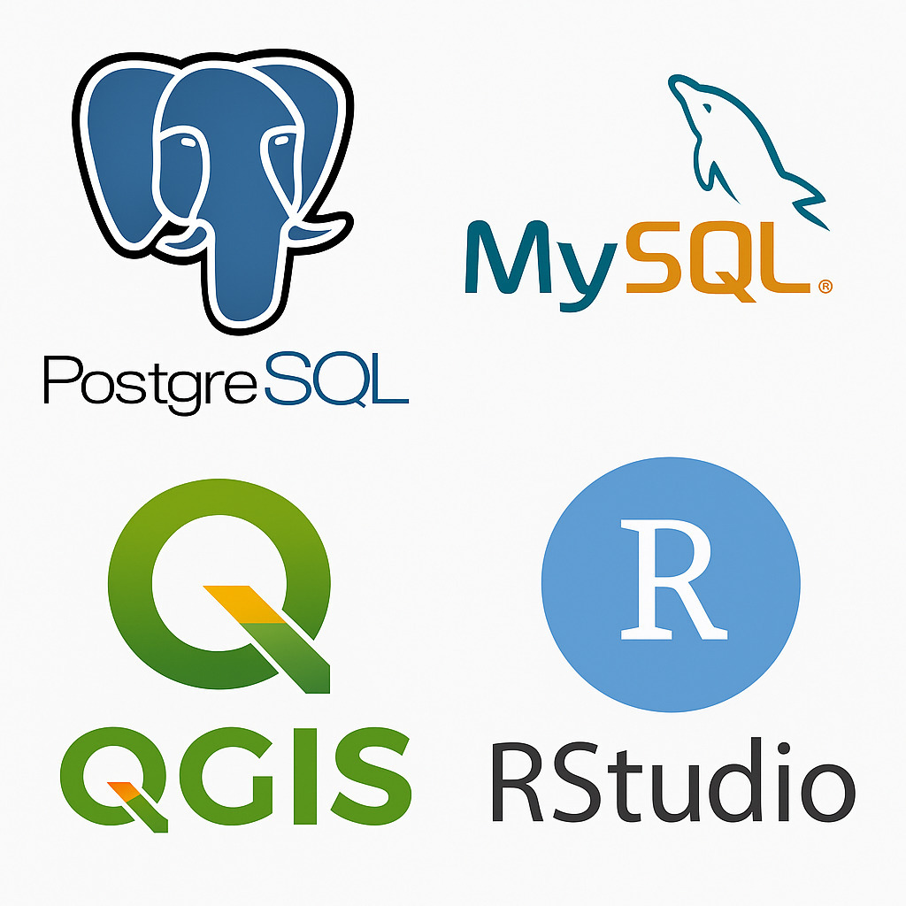
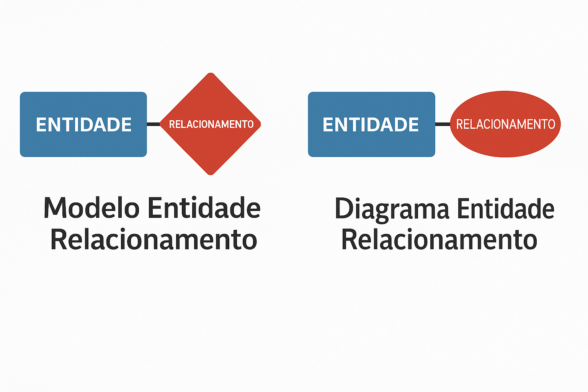

# **Aula Inaugural**

#### **2026/10/02** {.unnumbered}

#### Professor **Miguél Suares** {.unnumbered}

## Disciplina: **Banco de Dados**

-   Curso: Análise e Desenvolvimento de Sistemas (ADS)
-   Período: **Noturno**
-   Turma: **1º semestre de 2026**
-   Campus: **Chácara Santo Antônio**

> "Dados são o novo petróleo." – Clive Humby!

------------------------------------------------------------------------

## 👨‍🏫 Sobre o Professor

-   Nome: Prof. Miguél Suares
-   Formação: Mestre em Engenharia da Computação e Energia da Agricultura
-   Experiência: +10 anos com bancos de dados relacionais e análise de dados
-   Contato: [miguel.penteado\@docente.unip.br](mailto:miguel.penteado@docente.unip.br)

------------------------------------------------------------------------

## 🎯 Objetivos da Disciplina

-   Compreender os fundamentos de bancos de dados

-   Modelar dados com diagramas ER

-   Implementar e consultar bases de dados com SQL

-   Utilizar ferramentas como MySQL, PostgreSQL, QGIS e R

-   Desenvolver raciocínio lógico para resolver problemas com dados

    

------------------------------------------------------------------------

## 📅 Calendário da Disciplina

| Data       | Aula    | Tema                          |
|------------|---------|-------------------------------|
| 04/08/2025 | Aula 1  | Aula Inaugural                |
| 11/08/2025 | Aula 2  | Fundamentos                   |
| 18/08/2025 | Aula 3  | Modelagem e Diagramas         |
| 25/08/2025 | Aula 4  | Administração e Gerenciamento |
| 01/09/2025 | Aula 5  | Aplicação CRUD                |
| 08/09/2025 | Aula 6  | MySQL                         |
| 15/09/2025 | **NP1** | **Prova**                     |
| 22/09/2025 | Aula 7  | Postgres                      |
| 29/09/2025 | Aula 8  | QGIS                          |
| 06/10/2025 | Aula 9  | RStudio                       |
| 13/10/2025 | Aula 10 | Análise I                     |
| 20/10/2025 | Aula 11 | Análise II                    |
| 27/10/2025 | Aula 12 | Análise III                   |
| 03/11/2025 | **NP2** | **Prova**                     |

------------------------------------------------------------------------

## 📚 Ementa Resumida

-   Introdução a bancos de dados relacionais (RDBMS)

-   Modelagem de dados (M.E.R.) e diagramas Entidade Relacionamento (D.E.R.)

-   Linguagem SQL: DDL, DML, DCL

-   Ferramentas: MySQL, PostgreSQL

-   Visualização geoespacial (QGIS)

-   Análise e exploração de dados (R e RStudio)

    

------------------------------------------------------------------------

## 📝 Avaliação

-   **Provas (NP1 + NP2)**
-   **Prova Substitutiva**
-   **Exame**

------------------------------------------------------------------------

## 🛠️ Ferramentas da Disciplina

-   **Servidores de Banco de Dados**: MySQL, PostgreSQL
-   **Servidores de Banco de Dados**: pgAdmin, MySQL Workbench, DBeaver\\
-   **Geoprocessamento**: QGIS\\
-   **Análise de Dados**: R + RStudio\\
-   **Versionamento e Organização**: GitHub, Teams

------------------------------------------------------------------------

## 📌 Expectativas e Regras

-   Pontualidade e entrega de atividades no prazo
-   Trabalhos devem ser originais (sem plágio)
-   Participação ativa nas discussões e práticas
-   Uso responsável das ferramentas
-   Respeito e colaboração entre colegas

------------------------------------------------------------------------

## 💡 Dicas para Mandar Bem

-   Faça os exercícios logo após a aula
-   Participe das práticas com base real
-   Mantenha o repositório do projeto atualizado
-   Refaça consultas SQL até entender
-   Teste e documente suas soluções

------------------------------------------------------------------------

## 🙌 Encerramento

## Estamos prontos?

📧 Dúvidas? Estou à disposição\
📊 Vamos construir conhecimento juntos!

```{r 01-2026-02-10_Inaugural-html , eval=FALSE, include=FALSE}
rmarkdown::render("01-2026-02-10_Inaugural.Rmd", output_dir="docs", output_file ="temporario.html" , output_format = "html_document") ; utils::browseURL("docs/temporario.html")
```

```{r 01-2026-02-10_Inaugural-pdf , eval=FALSE, include=FALSE}
rmarkdown::render("01-2026-02-10_Inaugural.Rmd", output_dir="docs", output_file ="temporario.pdf" , output_format = rmarkdown::pdf_document( toc = TRUE, number_sections = TRUE, latex_engine = "xelatex" )) ; utils::browseURL("docs/temporario.pdf")
```
