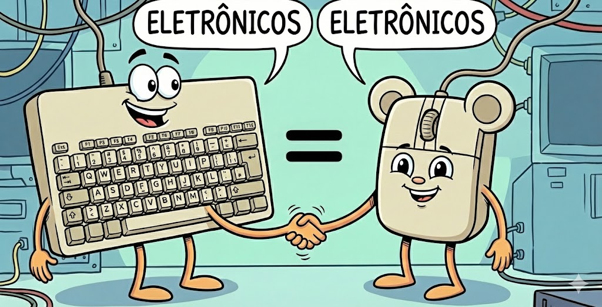
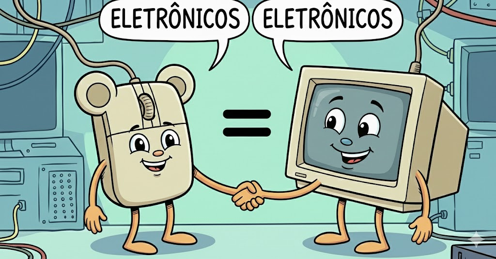

# Fundamentos de Sistemas de Bancos de Dados

#### 24/02/2026 {.unnumbered}

#### Professor Miguel Suares {.unnumbered}

## Parte I — Linha do Tempo dos SGBDs

### O Início do Modelo Relacional

### Edgar F. Codd (1923–2003)

{width="350"}

-   Matemático da IBM
-   1970: Publica o artigo:

> **“A Relational Model of Data for Large Shared Data Banks”** (Um modelo relacional de dados para grandes bancos de dados compartilhados)

Base matemática do modelo:

-   Teoria dos Conjuntos
-   Lógica de Predicados
-   Álgebra Relacional

### System R e SQL

-   1970–1974: Desenvolvimento do **System R**
-   1974: Criação da linguagem **SQL**

### Raymond F. Boyce

{width="300"}

### Donald D. Chamberlin

### Modelo Entidade-Relacionamento

### Peter Chen

{width="400"}

-   1976: Modelo ER
-   Ponte entre modelagem conceitual e implementação relacional

### Escola de Berkeley

### Prof Michael Stonebraker

{width="350"}

-   Projeto INGRES
-   Origem do Postgres

### Décadas de Consolidação

#### 1980

-   IBM DB2
-   Oracle
-   Sybase
-   Postgres

#### 1990

-   PostgreSQL
-   MySQL

{width="350"} {width="350"}

### Anos 2000 — Big Data e NoSQL

{width="350"} {width="350"} {width="350"}

## Parte II — Fundamentos Matemáticos do Modelo Relacional

Agora entramos na base formal que sustenta os SGBDs.

## 1. Conceito de Relação

Codd queria utilizar a Matemática, mais específicamente, a teoria de conjuntos para criar um Sistema de Banco de Dados. A Matemática trataria de garantir a consistência dos dados armazenados.

| Operação           | Símbolo | Descrição                                  |
|--------------------|---------|--------------------------------------------|
| União              | ∪       | Elementos que pertencem a A ou B           |
| Interseção         | ∩       | Elementos comuns a A e B                   |
| Diferença          | −       | Elementos de A que não pertencem a B       |
| Produto Cartesiano | ×       | Conjunto de todos os pares ordenados (a,b) |

Inicialmente a idéia era associar conjuntos de dados e garantir a consistência da informação. Assim nasceu o conceito de **RELAÇÃO**

Sejam dois conjuntos A e B.

O **produto cartesiano** é:

```         
A × B = { (a,b) | a ∈ A e b ∈ B }
```

Uma **relação R de A em B** é qualquer subconjunto de A × B.

```         
R ⊆ A × B
```

*(lembrando que o simbolo "⊆" significa "está contido em" ou "é subconjunto de")*

#### Exemplo 1.

Uma website vende camisetas **básicas** e camisetas **esportivas** nos tamanhos **pequeno**, **médio** e **grande**. Usando matemática, coloque as camisetas no **conjunto A** e os tamanhos no **conjunto B**. Utilize o **produto cartesiano** para gerar toda a **grade de camisetas e tamanhos** na página do website.

```{r aula02-exemplo-01, engine='tikz', echo=FALSE, fig.cap="Camisetas X Tamanhos"}
\usetikzlibrary{arrows,positioning,shapes,fit,calc}

\pgfdeclarelayer{background}
\pgfsetlayers{background,main}

\begin{tikzpicture}
[
  every node/.style={on grid},
  setA/.style={fill=blue,               circle,  inner sep=3pt },
  setB/.style={fill=green!70!black,     circle,  inner sep=3pt },
  setC/.style={fill=red!70!black,       circle,  inner sep=3pt },
  every fit/.style={draw, fill=gray!10, ellipse, inner sep=8pt},
  >=latex
]

% --- Conjunto A (Camisetas) ---
\begin{scope}[node distance=1cm and 6cm]
  \node [setA, label=left:Básica]     (a1) {};
  \node [setA, below=of a1, label=left:Esportiva] (a2) {};
  \node [above=1.5cm of a1, font=\bfseries, align=center] {Conjunto A\\Camisetas};
\end{scope}

% --- Conjunto B (Tamanhos) ---
\begin{scope}[node distance=1cm and 6cm]
  \node [setB, right=of a1, label=right:P] (b1) {};
  \node [setB, below=of b1, label=right:M] (b2) {};
  \node [setB, below=of b2, label=right:G] (b3) {};
  \node [above=1.5cm of b1, font=\bfseries, align=center] {Conjunto B\\Tamanhos};
\end{scope}


% As setas (funções)
%\draw[<->,shorten >=3pt] (a1) -- node[above]  {} (b1);
%\draw[<->,shorten >=3pt] (a1) -- node[above]  {} (b2);
%\draw[<->,shorten >=3pt] (a1) -- node[above]  {} (b3);
%\draw[<->,shorten >=3pt] (a2) -- node[above]  {} (b1);
%\draw[<->,shorten >=3pt] (a2) -- node[above]  {} (b2);
%\draw[<->,shorten >=3pt] (a2) -- node[above]  {} (b3);


% ----------------------------
% --- Conjunto C: C = A x B ---
% ----------------------------

\def\dx{1.5pt}
\def\dy{5mm}

% Linha 1: (Básica, P)
\node [setC, below=4cm of a2, xshift=3cm, label=left:Básica] (cA11) {};
\node [font=\bfseries] (cComma11) at ([xshift=\dx] cA11.east) {,};
\node [setC, anchor=west, xshift=-\dx, label=right:P] (cB11) at (cComma11.east) {};

% Linha 2: (Básica, M)
\node [setC, below=\dy of cA11, label=left:Básica] (cA12) {};
\node [font=\bfseries] (cComma12) at ([xshift=\dx] cA12.east) {,};
\node [setC, anchor=west, xshift=-\dx, label=right:M] (cB12) at (cComma12.east) {};

% Linha 3: (Básica, G)
\node [setC, below=\dy of cA12, label=left:Básica] (cA13) {};
\node [font=\bfseries] (cComma13) at ([xshift=\dx] cA13.east) {,};
\node [setC, anchor=west, xshift=-\dx, label=right:G] (cB13) at (cComma13.east) {};

% Linha 4: (Esportiva, P)
\node [setC, below=\dy of cA13, label=left:Esportiva] (cA21) {};
\node [font=\bfseries] (cComma21) at ([xshift=\dx] cA21.east) {,};
\node [setC, anchor=west, xshift=-\dx, label=right:P] (cB21) at (cComma21.east) {};

% Linha 5: (Esportiva, M)
\node [setC, below=\dy of cA21, label=left:Esportiva] (cA22) {};
\node [font=\bfseries] (cComma22) at ([xshift=\dx] cA22.east) {,};
\node [setC, anchor=west, xshift=-\dx, label=right:M] (cB22) at (cComma22.east) {};

% Linha 6: (Esportiva, G)
\node [setC, below=\dy of cA22, label=left:Esportiva] (cA23) {};
\node [font=\bfseries] (cComma23) at ([xshift=\dx] cA23.east) {,};
\node [setC, anchor=west, xshift=-\dx, label=right:G] (cB23) at (cComma23.east) {};

\node [above=1.5cm of cA11, xshift=-\dx, font=\bfseries, align=center] (titleC) {Conjunto C = A $\times$ B \\Grade de Camisetas};

% --- Camada de Fundo ---
\begin{pgfonlayer}{background}
  \node[fit=(a1) (a2)] {};
  \node[fit=(b1) (b2) (b3)] {};
  \node[fit=
    (titleC)
    (cA11)(cComma11)(cB11)
    (cA12)(cComma12)(cB12)
    (cA13)(cComma13)(cB13)
    (cA21)(cComma21)(cB21)
    (cA22)(cComma22)(cB22)
    (cA23)(cComma23)(cB23)
  ] {};
\end{pgfonlayer}

\end{tikzpicture}
```

No exemplo anterior, o conjunto C foi criado fazendo produto cartesiano de A x B. O **conjunto C** é uma **Relação.**

Contudo as operações da teoria dos conjuntos da matemática não eram suficientes para resolver algumas situações:

#### Exemplo 2.

Considere uma **cadastro de países** denominado **conjunto A = {Brasil, Argentina, Chile }** e um **cadastro de capitais** chamado **conjunto B = {Brasilia, Buenos Aires, Santiago}**. `Verifique se é possível` criar um **conjunto C** utilizando o **produto cartesiano** entre **A x B**, ou seja, uma **Relação**. Nesta **relação C**, **`cada país deve estar associado a sua capital`**.

```{r aula02-exemplo-02, engine='tikz', echo=FALSE, fig.cap="Capital X Países"}
\usetikzlibrary{arrows,positioning,shapes,fit,calc}

\pgfdeclarelayer{background}
\pgfsetlayers{background,main}


\begin{tikzpicture}
[
  every node/.style={on grid},
  setA/.style={fill=blue,               circle,  inner sep=3pt },
  setB/.style={fill=green!70!black,     circle,  inner sep=3pt },
  setC/.style={fill=red!70!black,       circle,  inner sep=3pt },
  every fit/.style={draw, fill=gray!10, ellipse, inner sep=12pt},
  >=latex
]


% --- Conjunto A (Países) ---
\begin{scope}[node distance=1cm and 6cm]
  \node [setA, label=left:Brasil]    (a1) {};
  \node [setA, below=of a1, label=left:Argentina] (a2) {};
  \node [setA, below=of a2, label=left:Chile]     (a3) {};
  \node [above=1.5cm of a1, font=\bfseries]            {Países};
\end{scope}

% --- Conjunto B (Capitais) ---
\begin{scope}[node distance=1cm and 6cm]
  \node [setB, right=of a1, label=right:Brasília]       (b1) {};
  \node [setB, below=of b1, label=right:{Buenos Aires}] (b2) {};
  \node [setB, below=of b2, label=right:{Santiago}]     (b3) {};
  \node [above=1.5cm of b1, font=\bfseries] {Capitais};
\end{scope}

% --- As Setas (Mapeamento) ---
%\draw[->, shorten >= 3pt, shorten <= 3pt, thick, gray!80] (a1) -- (b1);
%\draw[->, shorten >= 3pt, shorten <= 3pt, thick, gray!80] (a2) -- (b2);
%\draw[->, shorten >= 3pt, shorten <= 3pt, thick, gray!80] (a3) -- (b3);


% --- Conjunto C (layout: c1 ao lado de c2; c3 abaixo do par) ---
% --- Conjunto C: C = A x B (todos os pares ordenados) ---

% Âncoras e deslocamentos para ficar "quase encostado"
\def\dx{1.5pt}      % distância do c1 até a vírgula e da vírgula até c2
\def\dy{5mm}        % espaçamento vertical entre linhas (pares)

% Título
%\node [below=3cm of b1, font=\bfseries] (titleC) {C = A \times B};

% Linha 1: (Brasil, Brasília)
\node [setC, below=4cm of a3, xshift=3cm, label=left:Brasil, fill=blue] (cA11) {};
\node [font=\bfseries] (cComma11) at ([xshift=\dx] cA11.east) {,};
\node [setC, anchor=west, xshift=-\dx, label=right:Brasília, fill=blue] (cB11) at (cComma11.east) {};

% Linha 2: (Brasil, Buenos Aires)
\node [setC, below=\dy of cA11, label=left:Brasil] (cA12) {};
\node [font=\bfseries] (cComma12) at ([xshift=\dx] cA12.east) {,};
\node [setC, anchor=west, xshift=-\dx, label=right:{Buenos Aires}] (cB12) at (cComma12.east) {};

% Linha 3: (Brasil, Santiago)
\node [setC, below=\dy of cA12, label=left:Brasil] (cA13) {};
\node [font=\bfseries] (cComma13) at ([xshift=\dx] cA13.east) {,};
\node [setC, anchor=west, xshift=-\dx, label=right:Santiago] (cB13) at (cComma13.east) {};

% Linha 4: (Argentina, Brasília)
\node [setC, below=\dy of cA13, label=left:Argentina] (cA21) {};
\node [font=\bfseries] (cComma21) at ([xshift=\dx] cA21.east) {,};
\node [setC, anchor=west, xshift=-\dx, label=right:Brasília] (cB21) at (cComma21.east) {};

% Linha 5: (Argentina, Buenos Aires)
\node [setC, below=\dy of cA21, label=left:Argentina, fill=blue] (cA22) {};
\node [font=\bfseries] (cComma22) at ([xshift=\dx] cA22.east) {,};
\node [setC, anchor=west, xshift=-\dx, label=right:{Buenos Aires}, fill=blue] (cB22) at (cComma22.east) {};

% Linha 6: (Argentina, Santiago)
\node [setC, below=\dy of cA22, label=left:Argentina] (cA23) {};
\node [font=\bfseries] (cComma23) at ([xshift=\dx] cA23.east) {,};
\node [setC, anchor=west, xshift=-\dx, label=right:Santiago] (cB23) at (cComma23.east) {};

% Linha 7: (Chile, Brasília)
\node [setC, below=\dy of cA23, label=left:Chile] (cA31) {};
\node [font=\bfseries] (cComma31) at ([xshift=\dx] cA31.east) {,};
\node [setC, anchor=west, xshift=-\dx, label=right:Brasília] (cB31) at (cComma31.east) {};

% Linha 8: (Chile, Buenos Aires)
\node [setC, below=\dy of cA31, label=left:Chile] (cA32) {};
\node [font=\bfseries] (cComma32) at ([xshift=\dx] cA32.east) {,};
\node [setC, anchor=west, xshift=-\dx, label=right:{Buenos Aires}] (cB32) at (cComma32.east) {};

% Linha 9: (Chile, Santiago)
\node [setC, below=\dy of cA32, label=left:Chile, fill=blue] (cA33) {};
\node [font=\bfseries] (cComma33) at ([xshift=\dx] cA33.east) {,};
\node [setC, anchor=west, xshift=-\dx, label=right:Santiago, fill=blue] (cB33) at (cComma33.east) {};

\node [above=1.5cm of cA11, xshift=-\dx, font=\bfseries] (titleC) {Países X Capitais};


% --- Camada de Fundo (Elipses) ---
\begin{pgfonlayer}{background}
  \node[fit=(a1) (a2) (a3)] {};
  \node[fit=(b1) (b2) (b3)] {};
  \node[fit= (titleC) (cComma11) (cComma12) (cComma13) (cComma21) (cComma22)  (cComma23)  (cComma31)  (cComma32) (cComma33) ] {};
\end{pgfonlayer}

\end{tikzpicture}


```

Verificando a operação de **produto cartesiano** que gerou o **conjunto C** produziu **9 pares ordenados**. Mas para nosso contexto (**associar países e suas capitais**) dos **9 pares** gerados, apenas **`3 pares ordenados fazem sentido`**: C= {(**Brasil, Brasilia**), (**Argentina, Buenos Aires**), (**Chile, Santiago**)} ; os outros **6 pares não fazem sentido** na associação de Países e Capitais.

Portanto, para este contexto, apenas a operação de produto cartesiano não atendeu os requisitos para gerar um conjunto de dados consistente a partir de dois cadastros (dois conjuntos) fornecidos.

### A Solução vem da Matemática: FUNÇÕES como RELACIONAMENTOS:

Uma **função** é uma relação especial entre dois conjuntos.

Sejam ( A ) e ( B ) conjuntos.

Uma função

$f: A \to B$

é um subconjunto do produto cartesiano

$f \subseteq A \times B$

em bom português: \>\> Uma função f(x) é uma regra que associa cada elemento de A a exatamente um elemento de B.

As funções f(x) agem como uma filtragem para selecionar do produto cartesiano apenas os pares de elementos que fazem sentido:

As funções podem ser vistas como setas mapeando cada ponto de um conjunto no outro.

No exemplo da loja de camisetas, temos cada elemento do "conjunto A" mapeando todos os elementos do "conjunto B". É a representação gráfica do produto cartesiano e seus pares ordenados.

```{r aula02-exemplo-03, engine='tikz', echo=FALSE, fig.cap="camisetas X Tamanhos"}
\usetikzlibrary{arrows,positioning,shapes,fit,calc}

\pgfdeclarelayer{background}
\pgfsetlayers{background,main}

\begin{tikzpicture}
[
  every node/.style={on grid},
  setA/.style={fill=blue,               circle,  inner sep=3pt },
  setB/.style={fill=green!70!black,     circle,  inner sep=3pt },
  setC/.style={fill=red!70!black,       circle,  inner sep=3pt },
  every fit/.style={draw, fill=gray!10, ellipse, inner sep=8pt},
  >=latex
]

% --- Conjunto A (Camisetas) ---
\begin{scope}[node distance=1cm and 6cm]
  \node [setA, label=left:Básica]     (a1) {};
  \node [setA, below=of a1, label=left:Esportiva] (a2) {};
  \node [above=1.5cm of a1, font=\bfseries, align=center] {Conjunto A\\Camisetas};
\end{scope}

% --- Conjunto B (Tamanhos) ---
\begin{scope}[node distance=1cm and 6cm]
  \node [setB, right=of a1, label=right:P] (b1) {};
  \node [setB, below=of b1, label=right:M] (b2) {};
  \node [setB, below=of b2, label=right:G] (b3) {};
  \node [above=1.5cm of b1, font=\bfseries, align=center] {Conjunto B\\Tamanhos};
\end{scope}


% As setas (funções)
\draw[<->,shorten >=3pt] (a1) -- node[near start , above, sloped, text=blue] {$f(\text{Básica})$} (b1);
\draw[<->,shorten >=3pt] (a1) -- node[near start , above, sloped, text=blue] {$f(\text{Básica})$} (b2);
\draw[<->,shorten >=3pt] (a1) -- node[near start , above, sloped, text=blue] {$f(\text{Básica})$} (b3);
\draw[<->,shorten >=3pt] (a2) -- node[near end   , above, sloped, text=red] {$g(\text{Esportiva})$} (b1);
\draw[<->,shorten >=3pt] (a2) -- node[near end   , above, sloped, text=red] {$g(\text{Esportiva})$} (b2);
\draw[<->,shorten >=3pt] (a2) -- node[near end   , above, sloped, text=red] {$g(\text{Esportiva})$} (b3);

% --- Camada de Fundo (Elipses) ---
\begin{pgfonlayer}{background}
  \node[fit=(a1) (a2) ] {};
  \node[fit=(b1) (b2) (b3)] {};
\end{pgfonlayer}

\end{tikzpicture}

```

No exemplo dos países e suas capitais, temos um elemento do "conjunto A" mapeando um elemento do "conjunto B". É um subconjunto do produto cartesiano de A X B, ou seja, uma filtragem aplicada ao produto cartesiano. Na terminologia das funções, é uma função bijetora.

```{r aula02-exemplo-04, engine='tikz', echo=FALSE, fig.cap="Países X Capitais"}
\usetikzlibrary{arrows,positioning,shapes,fit,calc}

\pgfdeclarelayer{background}
\pgfsetlayers{background,main}


\begin{tikzpicture}
[
  every node/.style={on grid},
  setA/.style={fill=blue,               circle,  inner sep=3pt },
  setB/.style={fill=green!70!black,     circle,  inner sep=3pt },
  setC/.style={fill=red!70!black,       circle,  inner sep=3pt },
  every fit/.style={draw, fill=gray!10, ellipse, inner sep=12pt},
  >=latex
]


% --- Conjunto A (Países) ---
\begin{scope}[node distance=1cm and 6cm]
  \node [setA, label=left:Brasil]    (a1) {};
  \node [setA, below=of a1, label=left:Argentina] (a2) {};
  \node [setA, below=of a2, label=left:Chile]     (a3) {};
  \node [above=1.5cm of a1, font=\bfseries]            {Países};
\end{scope}

% --- Conjunto B (Capitais) ---
\begin{scope}[node distance=1cm and 6cm]
  \node [setB, right=of a1, label=right:Brasília]       (b1) {};
  \node [setB, below=of b1, label=right:{Buenos Aires}] (b2) {};
  \node [setB, below=of b2, label=right:{Santiago}]     (b3) {};
  \node [above=1.5cm of b1, font=\bfseries] {Capitais};
\end{scope}

% --- As Setas (Mapeamento) ---
\draw[<->,shorten >=3pt] (a1) -- node[near start , above, sloped, text=red] {$f(\text{Brasil})$} (b1);
\draw[<->,shorten >=3pt] (a2) -- node[near start , above, sloped, text=red] {$f(\text{Argentina})$} (b2);
\draw[<->,shorten >=3pt] (a3) -- node[near start , above, sloped, text=red] {$f(\text{Chile})$} (b3);


% --- Conjunto C (layout: c1 ao lado de c2; c3 abaixo do par) ---
% --- Conjunto C: C = A x B (todos os pares ordenados) ---

% Âncoras e deslocamentos para ficar "quase encostado"
\def\dx{1.5pt}      % distância do c1 até a vírgula e da vírgula até c2
\def\dy{5mm}        % espaçamento vertical entre linhas (pares)


% --- Camada de Fundo (Elipses) ---
\begin{pgfonlayer}{background}
  \node[fit=(a1) (a2) (a3)] {};
  \node[fit=(b1) (b2) (b3)] {};
\end{pgfonlayer}

\end{tikzpicture}
```

Conclusão de Codd: apenas as operações convencionais da teoria de conjuntos não seria suficiente para projetar sistema de banco de dados. Seria necessária a adição de elementos teoria das funções aplicada a teoria das relações.

Professor Codd cria as operações de Algebra Relacional associada a Relações.

Nasce o conceito de Banco de Dados Relacional e os conceitos que irão criar a linguagem SQL (Structured Query Language).

### Relação em Banco de Dados

Considere:

| Terminologia Relacional | Banco de Dados | Origem Matemática |
|:-----------------:|:---------------:|:----------------------------------:|
| RELAÇÃO | **TABELA** | CONJUNTO ou SUBCONJUNTO |
| ATRIBUTO | **COLUNAS** | Não aparece explicitamente |
| TUPLA | **LINHA** | ELEMENTO DO CONJUNTO OU PAR ORDENADO |

## 2. Operações Relacionais

Baseadas na Álgebra Relacional de Codd.

| Operação           | Símbolo | Descrição                    |
|--------------------|---------|------------------------------|
| Seleção            | σ       | Filtra linhas                |
| Projeção           | π       | Seleciona colunas            |
| União              | ∪       | Combina relações compatíveis |
| Interseção         | ∩       | Elementos comuns             |
| Diferença          | −       | Subtração                    |
| Produto Cartesiano | ×       | Combinação total             |
| Junção             | ⋈       | Produto + Seleção            |
| Divisão            | ÷       | Consulta universal           |

Todas as operações Relacionais são operações SQL e serão estudadas na aula 4 (Modelagem parte 2).

## 3. Propriedades de Relações

Seja R ⊆ A × A.

### 3.1 Reflexiva

"Todo elemento é equivalente a si mesmo"

```         
∀x ∈ A, (x,x) ∈ R
```

#### Exemplo "Cadastro de Produtos - Popriedade "Reflexiva" da Relação:
Em um cadastro de produtos, o produto Teclado tem a mesma categoria que o produto Teclado (ele mesmo). Consequentemente, em uma tabela do Banco de Dados, o valor da coluna "CategoriaID" de um registro é sempre igual ao "CategoriaID" dele mesmo.

{width="255"}

### 3.2 Simétrica

"Se o **primeiro equivale ao segundo**, então o **segundo equivale ao primeiro**"

```         
Se (x,y) ∈ R então (y,x) ∈ R
```

#### Exemplo: "Cadastro de Produtos - Popriedade "Simétrica" da Relação:
Se o **Teclado** (1) **é equivalente** ao **Mouse** (2) (ambos são da categoria **Eletrônicos**), então o **Mouse** (2) **é equivalente** ao **Teclado** (1). Consequentemente, no Banco de Dados, **Teclado.CategoriaID** = **Mouse.CategoriaID.**

{width="327"}

Essa propriedade é utilizada para fazer "pareamento" entre tabelas.

### 3.3 Transitiva

"Se o **primeiro equivale ao segundo**, e o **segundo equivale ao terceiro**", então **primeiro equivale ao terceiro."**

```         
Se (x,y) ∈ R e (y,z) ∈ R então (x,z) ∈ R
```

#### Exemplo: "Cadastro de Produtos - Popriedade "Transitiva" da Relação:
Se **Teclado** (1) **é equivalente** ao **Mouse** (2) e **Mouse** (2) **é equivalente** ao **Monitor** (3), então obrigatoriamente **Teclado** (1) **é equivalente** ao **Monitor** (3), **pois todos são da categoria "Eletrônicos"**.

|  |  |  |
|------------------------|------------------------|------------------------|
|  |  |  |

Isso garante que todos os elementos de uma categoria formem um grupo fechado e coeso.

### 3.4 Antissimétrica

"Se o **primeiro equivale ao segundo**, então o **segundo NÃO PODE equivaler ao primeiro**"

```         
Se (x,y) ∈ R e (y,x) ∈ R então x = y
```

#### Exemplo: "Cadastro de Funcionários - Popriedade "Anti-Simétrica" da Relação:
Se o **João é gerente da Maria**, a **Maria NÃO PODE ser gerente do João**. Em uma tabela de funcionários, o Banco de dados garante HIERARQUIA na regra de negócio.

{width="467"}

## 4. Relação de Equivalência

Uma relação é de equivalência se é:

-   Reflexiva
-   Simétrica
-   Transitiva

#### Exemplo: "Cadastro de Produtos - "Teste de Relação e Equivalência":
Tenho uma tabela de produtos. Todos os produtos estão classificados em categorias. Prove nesta tabela que 2 produtos são equivalentes.

|                   |                     |                          |
|-------------------|---------------------|--------------------------|
| **ID (Elemento)** | **Nome do Produto** | **CategoriaID (Classe)** |
| 1                 | Teclado             | 1 (Eletrônicos)          |
| 2                 | Mouse               | 1 (Eletrônicos)          |
| 3                 | Monitor             | 1 (Eletrônicos)          |
| 4                 | Camisa              | 2 (Vestuário)            |
| 5                 | Calça               | 2 (Vestuário)            |
| 6                 | Tênis               | 2 (Vestuário)            |
| 7                 | Livro SQL           | 3 (Livraria)             |
| 8                 | Livro Java          | 3 (Livraria)             |
| 9                 | Livro Redes         | 3 (Livraria)             |
| 10                | Cadeira             | 4 (Móveis)               |
| 11                | Mesa                | 4 (Móveis)               |
| 12                | Sofá                | 4 (Móveis)               |

##### Resolução:

"Dois produtos são equivalentes se pertencerem à mesma categoria."

"Dois produtos não são equivalentes se pertencerem a categorias diferentes."

Para provar isso, é preciso testar as 3 propriedades de relações (Reflexiva, Simétrica e Transitiva) em relação ao ponto comum entre eles, que é no caso "categoria".

Tomarei como exemplo "Cadeira, Mesa, Sofá". Analisarei segundo a caracteristica comum "categoria":

1)  

    -   Reflexiva - Cadeira é da mesma categoria que cadeira ? Sim - OK

2)  

    -   Simétrica - Cadeira é da mesma categoria que mesa e Mesa é da mesma categoria que Cadeira ? Sim - OK

3)  

    -   Transitiva - Cadeira é da mesma categoria que mesa; Mesa é da mesma categira que sofá; portanto cadeira é da mesma categoria que sofá ? Sim - OK

Considerando que cadeira, mesa e sofá atendem as propriedades "Reflexiva", "Simétrica" e "Transitiva", então "Cadeira, Mesa, Sofá" constituem a mesma classe de equivalencia.

### Classes de Equivalência

Dada relação \~ em A:

A classe de equivalência de x é:

```         
[x] = { y ∈ A | y ~ x }
```

Exemplo em uma relação de Banco de Dados formada pelo `conjunto A Produtos` e pelo
`conjunto B Categorias`:

R ⊆ A × B :

```{r aula02-exemplo-05, engine='tikz', echo=FALSE, fig.cap="Produtos X Categorias"}
\usetikzlibrary{arrows,positioning,shapes,fit,calc}

\pgfdeclarelayer{background}
\pgfsetlayers{background,main}

\begin{tikzpicture}
[
 every node/.style={on grid},
  setA/.style={fill=blue!60,            circle,  inner sep=3pt},
  setB/.style={                         circle,  inner sep=3pt},
  setC/.style={fill=red!70!black,       circle,  inner sep=3pt },
  every fit/.style={draw, fill=gray!10, ellipse, inner sep=10pt, minimum width=8cm,
    minimum height=3cm},
  >=latex
]

% --- Conjunto A (Produtos) ---
\begin{scope}[node distance=0.9cm and 7.5cm]
  \node [setA, label=left:Teclado]     (a1)  {};
  \node [setA, below=of a1, label=left:Mouse]       (a2)  {};
  \node [setA, below=of a2, label=left:Monitor]     (a3)  {};
  \node [setA, below=of a3, label=left:Camisa]      (a4)  {};
  \node [setA, below=of a4, label=left:Calça]       (a5)  {};
  \node [setA, below=of a5, label=left:Tênis]       (a6)  {};
  \node [setA, below=of a6, label=left:Livro SQL]   (a7)  {};
  \node [setA, below=of a7, label=left:Livro Java]  (a8)  {};
  \node [setA, below=of a8, label=left:Livro Redes] (a9)  {};
  \node [setA, below=of a9, label=left:Cadeira]     (a10) {};
  \node [setA, below=of a10,label=left:Mesa]        (a11) {};
  \node [setA, below=of a11,label=left:Sofá]        (a12) {};

  \node [above=3cm of a1, font=\bfseries, align=center]
  {Conjunto A\\Produtos de venda};
\end{scope}

% --- Conjunto B (Categorias com cores diferentes) ---
\begin{scope}[node distance=1.4cm and 7.5cm]
  \node [setB, fill=blue!70, right=9cm of a1, label=right:Eletrônicos] (b1) {};
  \node [setB, fill=green!70!black, below=of b1, label=right:Vestuário]   (b2) {};
  \node [setB, fill=purple!70, below=of b2, label=right:Livraria]    (b3) {};
  \node [setB, fill=red!70, below=of b3, label=right:Móveis]      (b4) {};

  \node [above=2cm of b1, font=\bfseries, align=center]
  {Conjunto B\\Categorias};
\end{scope}

% --- Relação real R ⊆ A×B ---

% Eletrônicos (azul)
\draw[->,shorten >=3pt, thick, blue] (a1) -- node[near start , above, sloped, text=blue] {$f(\text{Teclado})=\text{Eletrônicos}$} (b1);
\draw[->,shorten >=3pt, thick, blue] (a2) -- node[near start , above, sloped, text=blue] {$f(\text{Mouse})=\text{Eletrônicos}$} (b1);
\draw[->,shorten >=3pt, thick, blue] (a3) -- node[near start , above, sloped, text=blue] {$f(\text{Monitor})=\text{Eletrônicos}$} (b1);

% Vestuário (verde)
\draw[->,shorten >=3pt, thick, green!70!black] (a4) -- node[near start , above, sloped, text=green] {$f(\text{Camisa})=\text{Vestuário}$} (b2);
\draw[->,shorten >=3pt, thick, green!70!black] (a5) -- node[near start , above, sloped, text=green] {$f(\text{Calça})=\text{Vestuário}$} (b2);
\draw[->,shorten >=3pt, thick, green!70!black] (a6) -- node[near start , above, sloped, text=green] {$f(\text{Tênis})=\text{Vestuário}$} (b2);

% Livraria (roxo)
\draw[->,shorten >=3pt, thick, purple] (a7) -- node[near start , above, sloped, text=purple] {$f(\text{Livro SQL})=\text{Livraria}$} (b3);
\draw[->,shorten >=3pt, thick, purple] (a8) -- node[near start , above, sloped, text=purple] {$f(\text{Livro JAVA})=\text{Livraria}$} (b3);
\draw[->,shorten >=3pt, thick, purple] (a9) -- node[near start , above, sloped, text=purple] {$f(\text{Livro REDES})=\text{Livraria}$} (b3);

% Móveis (vermelho)
\draw[->,shorten >=3pt, thick, red] (a10) -- node[near start , above, sloped, text=red] {$f(\text{Cadeira})=\text{Móveis}$} (b4);
\draw[->,shorten >=3pt, thick, red] (a11) -- node[near start , above, sloped, text=red] {$f(\text{Mesa})=\text{Móveis}$} (b4);
\draw[->,shorten >=3pt, thick, red] (a12) -- node[near start , above, sloped, text=red] {$f(\text{Sofá})=\text{Móveis}$} (b4);


% --- Conjunto C (layout: lista de pares ordenados de R) ---
% Aqui mostramos explicitamente os pares (produto, categoria) pertencentes a R.
\def\dx{1.5pt}
\def\dy{8.0mm}


\node [below=4cm of b4, yshift=-2cm] (anchorC) {};


% Linha 1: (Teclado, Eletrônicos)
\node [setC, below=0cm of anchorC, xshift=-0.5cm, label=left:Teclado, fill=blue!80] (cA1) {};
\node [font=\bfseries] (cComma1) at ([xshift=\dx] cA1.east) {,};
\node [setC, anchor=west, xshift=-\dx, label=right:Eletr\^onicos, fill=blue!80] (cB1) at (cComma1.east) {};

% Linha 2: (Mouse, Eletrônicos)
\node [setC, below=\dy of cA1, label=left:Mouse, fill=blue!80] (cA2) {};
\node [font=\bfseries] (cComma2) at ([xshift=\dx] cA2.east) {,};
\node [setC, anchor=west, xshift=-\dx, label=right:Eletr\^onicos, fill=blue!80] (cB2) at (cComma2.east) {};

% Linha 3: (Monitor, Eletrônicos)
\node [setC, below=\dy of cA2, label=left:Monitor, fill=blue!80] (cA3) {};
\node [font=\bfseries] (cComma3) at ([xshift=\dx] cA3.east) {,};
\node [setC, anchor=west, xshift=-\dx, label=right:Eletr\^onicos, fill=blue!80] (cB3) at (cComma3.east) {};

% Linha 4: (Camisa, Vestuário)
\node [setC, below=\dy of cA3, label=left:Camisa, fill=green!70!black] (cA4) {};
\node [font=\bfseries] (cComma4) at ([xshift=\dx] cA4.east) {,};
\node [setC, anchor=west, xshift=-\dx, label=right:Vestu\'ario, fill=green!70!black] (cB4) at (cComma4.east) {};

% Linha 5: (Calça, Vestuário)
\node [setC, below=\dy of cA4, label=left:Cal\c ca, fill=green!70!black] (cA5) {};
\node [font=\bfseries] (cComma5) at ([xshift=\dx] cA5.east) {,};
\node [setC, anchor=west, xshift=-\dx, label=right:Vestu\'ario, fill=green!70!black] (cB5) at (cComma5.east) {};

% Linha 6: (Tênis, Vestuário)
\node [setC, below=\dy of cA5, label=left:T\^enis, fill=green!70!black] (cA6) {};
\node [font=\bfseries] (cComma6) at ([xshift=\dx] cA6.east) {,};
\node [setC, anchor=west, xshift=-\dx, label=right:Vestu\'ario, fill=green!70!black] (cB6) at (cComma6.east) {};

% Linha 7: (Livro SQL, Livraria)
\node [setC, below=\dy of cA6, label=left:Livro SQL, fill=purple!80] (cA7) {};
\node [font=\bfseries] (cComma7) at ([xshift=\dx] cA7.east) {,};
\node [setC, anchor=west, xshift=-\dx, label=right:Livraria, fill=purple!80] (cB7) at (cComma7.east) {};

% Linha 8: (Livro Java, Livraria)
\node [setC, below=\dy of cA7, label=left:Livro Java, fill=purple!80] (cA8) {};
\node [font=\bfseries] (cComma8) at ([xshift=\dx] cA8.east) {,};
\node [setC, anchor=west, xshift=-\dx, label=right:Livraria, fill=purple!80] (cB8) at (cComma8.east) {};

% Linha 9: (Livro Redes, Livraria)
\node [setC, below=\dy of cA8, label=left:Livro Redes, fill=purple!80] (cA9) {};
\node [font=\bfseries] (cComma9) at ([xshift=\dx] cA9.east) {,};
\node [setC, anchor=west, xshift=-\dx, label=right:Livraria, fill=purple!80] (cB9) at (cComma9.east) {};

% Linha 10: (Cadeira, Móveis)
\node [setC, below=\dy of cA9, label=left:Cadeira, fill=red!80] (cA10) {};
\node [font=\bfseries] (cComma10) at ([xshift=\dx] cA10.east) {,};
\node [setC, anchor=west, xshift=-\dx, label=right:M\'oveis, fill=red!80] (cB10) at (cComma10.east) {};

% Linha 11: (Mesa, Móveis)
\node [setC, below=\dy of cA10, label=left:Mesa, fill=red!80] (cA11) {};
\node [font=\bfseries] (cComma11) at ([xshift=\dx] cA11.east) {,};
\node [setC, anchor=west, xshift=-\dx, label=right:M\'oveis, fill=red!80] (cB11) at (cComma11.east) {};

% Linha 12: (Sofá, Móveis)
\node [setC, below=\dy of cA11, label=left:Sof\'a, fill=red!80] (cA12) {};
\node [font=\bfseries] (cComma12) at ([xshift=\dx] cA12.east) {,};
\node [setC, anchor=west, xshift=-\dx, label=right:M\'oveis, fill=red!80] (cB12) at (cComma12.east) {};

% --- Fundo ---
\begin{pgfonlayer}{background}
  \node[fit=(a1) (a12), draw, fill=gray!10, ellipse, inner sep=8pt] {};
  \node[fit=(b1) (b4),  draw, fill=gray!10, ellipse, inner sep=8pt] {};
  \node[fit=(cComma1) (cComma2) (cComma3) (cComma4) (cComma5) (cComma6) 
                 (cComma7) (cComma8) (cComma9) (cComma10) (cComma11) (cComma12)] {};
  \node[fit=(cA1) (cA12) (cB1) (cB12) (cComma1) (cComma12), name=fitC] {};
\end{pgfonlayer}

\node[above=6mm of fitC.north, font=\bfseries, align=center] (titleC)
{Conjunto C\\ $R \subseteq A \times B$};


\end{tikzpicture}
```


Chamamos de *Classes de Equivalência* todas as *relações de equivalência* que se
formam dentro da Relação.

São as "panelinhas" que se formam dentro do conjunto.

No nosso exemplo temas as seguintes Classes de Equivalência:

| Classe | Categoria   | Pares Ordenados                                                                     |
| ------ | ----------- | ----------------------------------------------------------------------------------- |
| 1      | Eletrônicos | 1. (Teclado, Eletrônicos)<br>2. (Mouse, Eletrônicos)<br>3. (Monitor, Eletrônicos)   |
| 2      | Vestuário   | 1. (Camisa, Vestuário)<br>2. (Calça, Vestuário)<br>3. (Tênis, Vestuário)            |
| 3      | Livraria    | 1. (Livro SQL, Livraria)<br>2. (Livro Java, Livraria)<br>3. (Livro Redes, Livraria) |
| 4      | Móveis      | 1. (Cadeira, Móveis)<br>2. (Mesa, Móveis)<br>3. (Sofá, Móveis)                      |

Observações importantes:

1-As classes são *disjuntas*;
2-A *união das quatro classes* é exatamente a relação $ R $;
3-Cada *par ordenado* pertence a uma *única classe*;


## 5. Dependências Funcionais

São os atributos de uma relação (colunas de uma tabela) cujos valores determinam
 os valores de outras colunas.

Exemplo: Imagine a Relação (Tabela) chamada *CursoProgramacao*.

| ID_Aluno | Nome_Aluno     | Cod_Curso | Nome_Curso      | ID_Instrutor | Nota_Final |
|----------|----------------|-----------|-----------------|--------------|------------|
| 10       | Alan Turing    | SQL-01    | Banco de Dados  | 500          | 9.5        |
| 20       | Ada Lovelace   | PY-02     | Python Avançado | 600          | 10.0       |
| 10       | Alan Turing    | PY-02     | Python Avançado | 600          | 8.0        |
| 30       | Grace Hopper   | SQL-01    | Banco de Dados  | 500          | 9.0        |
| 40       | Linus Torvalds | JS-03     | JavaScript      | 700          | 7.5        |

Considere as seguintes *Regras de Negócio*

- Cada aluno tem apenas um nome oficial.

- Cada código de curso pertence a apenas um nome de curso.

- Cada curso é ministrado por apenas um instrutor específico (um instrutor não muda de curso).

- Um aluno pode fazer vários cursos, e terá uma nota diferente para cada um.

Tendo estas informações identifique as DEPENDÊNCIAS FUNCIONAIS dos atributos da 
tabela.

Quais são os atributos da tabela?

| ID_Aluno | Nome_Aluno | Cod_Curso | Nome_Curso | ID_Instrutor | Nota_Final |
|----------|------------|-----------|------------|--------------|------------|

1) Quais destes atributos o valor identificam unicamente o valor de outro atributo?

| Atributo1 | Dependência Funcional |   Atributo2   | Resultado |
|:---------:|:---------------------:|:-------------:|:---------:|
|  ID_Aluno |        determina      |   Nome_Aluno  |     ?     |
| Cod_Curso |        determina      |   Nome_Curso  |     ?     |
| Cod_Curso |        determina      |  ID_Instrutor |     ?     |
|  ID_Aluno |        determina      |   Nota_Final  |     ?     |

2) Qual é a combinação de colunas necessária para determinar a *Nota_Final*?

### Resolução

1) Quais destes atributos o valor identificam unicamente o valor de outro atributo?

| Atributo1 | Dependência Funcional |   Atributo2   | Resultado | Comentário                                                                                                     |
|:---------:|:---------------------:|:-------------:|:---------:|----------------------------------------------------------------------------------------------------------------|
|  ID_Aluno |       determina       |   Nome_Aluno  |    SIM    | ID_Aluno valendo "10" determina Nome_Aluno "Alan Turing"                                                       |
| Cod_Curso |        determina      |   Nome_Curso  |    SIM    | Cod_Curso valendo "SQL-01" determina Nome_Curso "Banco de Dados"                                               |
| Cod_Curso |        determina      |  ID_Instrutor |    SIM    | Pela regra de negócio #3, Cod_Curso determina ID_Instrutor. Aqui temos um caso especial de Dependência Parcial |
|  ID_Aluno |        determina      |   Nota_Final  |    NÃO    | Olhe o Alan Turing (ID 10). Ele tem nota 9.5 e nota 8.0. ID_Aluno sozinho não determina a nota do aluno.       |

2) Qual é a combinação de colunas necessária para determinar a *Nota_Final*?

Eu preciso saber QUEM (Aluno) e em QUAL MATÉRIA (Curso) para te dar a nota exata. A combinação dos atributos {ID_Aluno, Cod_Curso} determinam Nota_Final! Esta é um caso de *Dependência Total*. 

## 6. Conceito de Fecho

Dado conjunto de atributos X e conjunto de dependências funcionais F:

O **fecho de X** (X⁺) é o conjunto de todos os atributos funcionalmente determinados por X.

Exemplo:

Dependências:

```         
A → B
B → C
```

Então:

```         
A⁺ = {A, B, C}
```

## 6. Normalização

Processo de organização de relações para:

-   Eliminar redundância
-   Evitar anomalias
-   Garantir consistência

### 1ª Forma Normal (1FN)

-   Atributos atômicos
-   Sem grupos repetitivos

### 2ª Forma Normal (2FN)

-   1FN
-   Sem dependência parcial de chave composta

### 3ª Forma Normal (3FN)

-   2FN
-   Sem dependência transitiva

### BCNF

Forma mais forte que 3FN:

Para toda dependência:

```         
X → Y
```

X deve ser superchave.


### Relações de Equivalência e Normalização

Dependências funcionais induzem partições do conjunto de tuplas.

Quando:

```         
A → B
```

Significa que valores iguais de A geram classes de equivalência nas tuplas.


## Conexão Final — A Base Matemática do SGBD

| Conceito Matemático     | Aplicação em BD            |
|-------------------------|----------------------------|
| Relação                 | Tabela                     |
| Produto cartesiano      | Combinação de domínios     |
| Relação de equivalência | Particionamento por chave  |
| Fecho                   | Descoberta de dependências |
| Transitiva              | Análise de dependências    |
| Antissimétrica          | Ordem parcial              |
| Álgebra relacional      | SQL                        |

```{r impressao-01, eval=FALSE, include=FALSE}
rmarkdown::render("02-2026-02-24_Fubdamentos_SGBD-aula.Rmd", output_dir="docs", output_file ="temporario.html" , output_format = "html_document") ; utils::browseURL("docs/temporario.html")
```


```{r impressao-02, eval=FALSE, include=FALSE}
rmarkdown::render("02-2026-02-24_Fubdamentos_SGBD-aula.Rmd", output_dir="docs", output_file ="temporario.docx" , output_format = "word_document") ; utils::browseURL("docs/temporario.docx")
```


