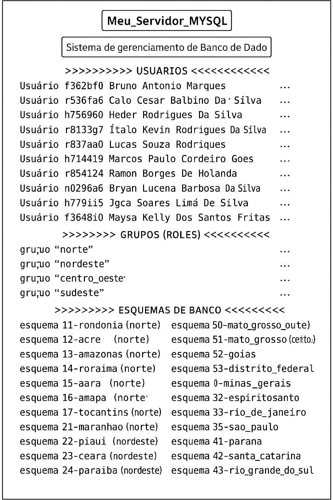

# Administração e Gerenciamento de Bancos de Dados

#### 25/08/2025 {.unnumbered}

#### Professor Miguél Suares {.unnumbered}

## Administração e Gerenciamento de Banco de Dados:

Por que administração e gerenciamento são fundamentais

-   Integridade e consistência

-   Garantir que as regras de negócio (restrições, chaves, relacionamentos) sejam sempre respeitadas.

-   Evitar dados duplicados ou incoerentes.

-   Disponibilidade e recuperação

-   Planejar backup e restore; criar políticas de alta disponibilidade e contingência para falhas ou desastres.

-   Segurança e controle de acesso

-   Definir quem pode ver, inserir, alterar ou excluir dados.

-   Atender requisitos de LGPD/privacidade e normas corporativas.

-   Desempenho e escalabilidade

-   Monitorar consultas lentas, criar índices adequados, ajustar parâmetros do SGBD para suportar crescimento do volume de dados.

-   Manutenção e evolução

-   Atualizar versões, aplicar patches, revisar modelos de dados à medida que a aplicação muda.

## Papel do DBA (Database Administrator)

O DBA é o profissional responsável por orquestrar tudo isso.Principais atribuições:

-   Projeto físico do banco (estrutura de tabelas, índices, partições).

-   Gestão de usuários e permissões – criação de contas, papéis (roles), políticas de segurança.

-   Backup e recuperação – políticas de backup, testes de restauração.

-   Monitoramento de desempenho – tuning de consultas, manutenção de índices, análise de logs.

-   Planejamento de capacidade – prever crescimento, escalabilidade e uso de recursos.

-   Atualizações e patches – manter o SGBD seguro e estável.

Sem administração e gerenciamento adequados, um banco de dados vira um “depósito de riscos”: falhas, lentidão, vazamento de informações ou perda definitiva de dados. O DBA atua como guardião da informação, garantindo que ela esteja correta, segura, disponível e performática, sustentando todas as operações da organização.

## Usuários, Grupos e Esquemas de Bancos de Dados

### Usuários

O que são ? Contas individuais que representam pessoas, aplicações ou serviços que acessam o banco.Cada usuário possui um nome de login e, geralmente, uma senha ou outro método de autenticação.

#### Funções principal

-   Conectar-se ao SGBD.

-   Executar operações de leitura, escrita ou administração conforme os privilégios concedidos.

#### Privilégios:

Podem ser específicos (ex.: SELECT em uma tabela) ou globais (ex.: CREATE DATABASE).

São a base do controle de acesso.

### Esquemas

O que são ? Um esquema é um container lógico de objetos do banco de dados. Ele organiza tabelas, views, funções, procedures, índices, triggers etc.

#### Por que usar

-   Facilita a organização (por projeto, por aplicação, por departamento).

-   Permite gestão de permissões mais granular: você pode conceder privilégios em nível de esquema.

-   Evita conflitos de nomes, pois objetos com o mesmo nome podem existir em esquemas diferentes.

### Grupos ou Roles

O que são ? Papéis coletivos que agrupam permissões e, muitas vezes, usuários.

No MySQL: CREATE ROLE ...

No PostgreSQL: roles podem ser usuários ou grupos.

#### Vantagens

-   Gerenciamento simplificado: conceda privilégios ao grupo e depois apenas adicione/remova usuários.

-   Consistência: garante que todos de uma equipe tenham as mesmas permissões.

-   Escalabilidade: ao entrar um novo membro, basta associá-lo ao role, sem revisar dezenas de tabelas.

### Sistema de Gerenciamento de Banco de Dados (S.G.B.D.)

O Sistema de Gerenciamento de Banco de Dados cuida não só de como as informações são armazenadas, mas também quem pode acessa-las, sob quais condições.



### Criação de usuários no MySQL

Podemos criar um novo usuário no SGBD MySQL através do seguinte comando SQL-DCL:

``` sql
CREATE USER 'nome_login'@'host' IDENTIFIED BY 'senha' COMMENT 'descrição';
```

| Parte | Função |
|:--:|:--:|
| 'nome_login' | Nome de login do novo usuário. |
| 'host' | Origem permitida de conexão. |
| IDENTIFIED BY 'senha' | Define a senha inicial. |
| COMMENT 'descrição' | (Opcional) Uma anotação de texto para identificar o usuário. |

Exemplo 1:

Crie o usuário do aluno "Bruno Marques". O usuário deve ser o RA do aluno e a sua senha deve ser *unip*.

``` sql
CREATE USER 'f362bf0'@'%' IDENTIFIED BY 'unip' COMMENT 'Bruno Antonio Marques';
```

Exemplo 2:

Crie os usuários de todos os alunos da sala. O usuário deve ser o RA do aluno e a sua senha deve ser *unip*.

``` sql

-- turma TI2P40

-- usuários no MySQL

DROP USER IF EXISTS 'f362bf0'@'%'; -- apaga o 'Bruno Antonio Marques';
DROP USER IF EXISTS 'r536fa6'@'%'; -- apaga o 'Caio Cesar Balbino Da Silva';
DROP USER IF EXISTS 'h756960'@'%'; -- apaga o 'Heder Rodrigues Da Silva';
DROP USER IF EXISTS 'r8133g7'@'%'; -- apaga o 'Ítalo Kevin Rodrigues Da Silva';
DROP USER IF EXISTS 'r837aa0'@'%'; -- apaga o 'Lucas Souza Rodrigues';
DROP USER IF EXISTS 'h714419'@'%'; -- apaga o 'Marcos Paulo Cordeiro Goes';
DROP USER IF EXISTS 'r854124'@'%'; -- apaga o 'Ramon Borges De Holanda';


CREATE USER 'f362bf0'@'%' IDENTIFIED BY 'unip' COMMENT  'Bruno Antonio Marques';
CREATE USER 'r536fa6'@'%' IDENTIFIED BY 'unip' COMMENT  'Caio Cesar Balbino Da Silva';
CREATE USER 'h756960'@'%' IDENTIFIED BY 'unip' COMMENT  'Heder Rodrigues Da Silva';
CREATE USER 'r8133g7'@'%' IDENTIFIED BY 'unip' COMMENT  'Ítalo Kevin Rodrigues Da Silva';
CREATE USER 'r837aa0'@'%' IDENTIFIED BY 'unip' COMMENT  'Lucas Souza Rodrigues';
CREATE USER 'h714419'@'%' IDENTIFIED BY 'unip' COMMENT  'Marcos Paulo Cordeiro Goes';
CREATE USER 'r854124'@'%' IDENTIFIED BY 'unip' COMMENT  'Ramon Borges De Holanda';

-- turma TI1P40

DROP USER IF EXISTS 'n0296a6'@'%'; -- apaga o 'Bryan Lucena Barbosa Da Silva';
DROP USER IF EXISTS 'h788986'@'%'; -- apaga o 'Igor Soares Lima Da Cunha';
DROP USER IF EXISTS 'h77gii5'@'%'; -- apaga o 'Jessica Cristina De S Silva';
DROP USER IF EXISTS 'f3648i0'@'%'; -- apaga o 'Maysa Kelly Dos Santos Freitas';


CREATE USER 'n0296a6'@'%' IDENTIFIED BY 'unip' COMMENT  'Bryan Lucena Barbosa Da Silva';
CREATE USER 'h788986'@'%' IDENTIFIED BY 'unip' COMMENT  'Igor Soares Lima Da Cunha';
CREATE USER 'h77gii5'@'%' IDENTIFIED BY 'unip' COMMENT  'Jessica Cristina De S Silva';
CREATE USER 'f3648i0'@'%' IDENTIFIED BY 'unip' COMMENT  'Maysa Kelly Dos Santos Freitas';
```

### Criação de Esquemas de Banco de Dados no MySQL

No MySQL, schema e database são sinônimos. É o “contêiner” onde ficam tabelas, views, procedures, usuários com permissões etc.

``` sql
CREATE DATABASE [IF NOT EXISTS] nome_do_schema  [OPTIONS];
```

| CREATE DATABASE: cria um novo banco.                          |
|---------------------------------------------------------------|
| IF NOT EXISTS: evita erro caso o schema já exista.            |
| nome_do_schema: nome do banco.                                |
| [OPTIONS]: parâmetros opcionais como CHARACTER SET ou COLLATE |

Exemplo 1:

Crie um esquema de Banco de Dados onde chamado 11-rondonia para guardar a tabela "Cidades";

``` sql
CREATE DATABASE IF NOT EXISTS `11-rondonia`;
```

Exemplo 2:

Crie um esquema de Banco de Dados de todas as Unidades da Federação para guardar tabelas "Cidades" dentro de cada uma:

``` sql
-- Script para criar um esquema (database) para cada UF brasileira
-- Nome do esquema: <código IBGE>-<nome_uf>
-- Ordenado pelo código IBGE
-- Compatível com MySQL 8

CREATE DATABASE IF NOT EXISTS `11-rondonia`;
CREATE DATABASE IF NOT EXISTS `12-acre`;
CREATE DATABASE IF NOT EXISTS `13-amazonas`;
CREATE DATABASE IF NOT EXISTS `14-roraima`;
CREATE DATABASE IF NOT EXISTS `15-para`;
CREATE DATABASE IF NOT EXISTS `16-amapa`;
CREATE DATABASE IF NOT EXISTS `17-tocantins`;
CREATE DATABASE IF NOT EXISTS `21-maranhao`;
CREATE DATABASE IF NOT EXISTS `22-piaui`;
CREATE DATABASE IF NOT EXISTS `23-ceara`;
CREATE DATABASE IF NOT EXISTS `24-rio_grande_do_norte`;
CREATE DATABASE IF NOT EXISTS `25-paraiba`;
CREATE DATABASE IF NOT EXISTS `26-pernambuco`;
CREATE DATABASE IF NOT EXISTS `27-alagoas`;
CREATE DATABASE IF NOT EXISTS `28-sergipe`;
CREATE DATABASE IF NOT EXISTS `29-bahia`;
CREATE DATABASE IF NOT EXISTS `31-minas_gerais`;
CREATE DATABASE IF NOT EXISTS `32-espiritosanto`;
CREATE DATABASE IF NOT EXISTS `33-rio_de_janeiro`;
CREATE DATABASE IF NOT EXISTS `35-sao_paulo`;
CREATE DATABASE IF NOT EXISTS `41-parana`;
CREATE DATABASE IF NOT EXISTS `42-santa_catarina`;
CREATE DATABASE IF NOT EXISTS `43-rio_grande_do_sul`;
CREATE DATABASE IF NOT EXISTS `50-mato_grosso_do_sul`;
CREATE DATABASE IF NOT EXISTS `51-mato_grosso`;
CREATE DATABASE IF NOT EXISTS `52-goias`;
CREATE DATABASE IF NOT EXISTS `53-distrito_federal`;
```

### Criando de Grupos de Permissões no MySQL:

No MySQL, roles (funções ou papéis) são grupos de permissões que você define uma vez e pode atribuir a vários usuários. Eles funcionam como “grupos de acesso”, facilitando o gerenciamento de privilégios. Em vez de conceder privilégios individualmente a cada usuário, você define tudo no role. Se precisar incluir um novo privilégio (ex.: UPDATE) para todos que já têm o role, basta atualizar o role uma vez.

Como criar uma regra no MySQL utilizando SQL-DCL

``` sql
CREATE ROLE 'nome_grupo';
```

onde, obviamente, *nome_grupo* é o nome do grupo a ser criado.

Exemplo 1:

Crie um grupo chamado *norte* para associar todas as unidades da federação da região norte do Brasil:

``` sql
CREATE ROLE 'norte';
```

Exemplo 2:

Crie um grupos para associar todas as unidades da federação de todas as regiões do Brasil:

``` sql
-- ===========================================
-- Criação de roles para as 5 regiões do Brasil
-- ===========================================

CREATE ROLE 'norte';
CREATE ROLE 'nordeste';
CREATE ROLE 'centro_oeste';
CREATE ROLE 'sudeste';
CREATE ROLE 'sul';

-- ===========================================
/*
Concedendo privilégios de leitura (SELECT) a cada grupo criado
*/
-- ===========================================

GRANT SELECT ON *.* TO 'norte';
GRANT SELECT ON *.* TO 'nordeste';
GRANT SELECT ON *.* TO 'centro_oeste';
GRANT SELECT ON *.* TO 'sudeste';
GRANT SELECT ON *.* TO 'sul';

-- ===========================================
-- Para atribuir um role a um usuário:
-- ===========================================
-- GRANT 'norte' TO 'usuario_exemplo'@'%';
-- SET DEFAULT ROLE 'norte' TO 'usuario_exemplo'@'%';
```

## Fazendo tudo funcionar: Colocando usuários em grupos e concedendo a estes acesso a Esquemas de Banco de Dados:

### Associando os esquemas que representam cada estado a cada grupo (que representa cada regição):

``` sql
-- ================================================
-- Associação dos esquemas (databases) aos roles
-- Roles criadas previamente:
--   norte, nordeste, centro_oeste, sudeste, sul
-- ================================================

-- >>>>> REGIÃO NORTE >>>>>>>>>>>>>>

GRANT ALL PRIVILEGES ON `11-rondonia`.*       TO 'norte';
GRANT ALL PRIVILEGES ON `12-acre`.*           TO 'norte';
GRANT ALL PRIVILEGES ON `13-amazonas`.*       TO 'norte';
GRANT ALL PRIVILEGES ON `14-roraima`.*        TO 'norte';
GRANT ALL PRIVILEGES ON `15-para`.*           TO 'norte';
GRANT ALL PRIVILEGES ON `16-amapa`.*          TO 'norte';
GRANT ALL PRIVILEGES ON `17-tocantins`.*      TO 'norte';

-- >>>>> REGIÃO NORDESTE >>>>>>>>>>>>>>

GRANT ALL PRIVILEGES ON `21-maranhao`.*            TO 'nordeste';
GRANT ALL PRIVILEGES ON `22-piaui`.*               TO 'nordeste';
GRANT ALL PRIVILEGES ON `23-ceara`.*               TO 'nordeste';
GRANT ALL PRIVILEGES ON `24-rio_grande_do_norte`.* TO 'nordeste';
GRANT ALL PRIVILEGES ON `25-paraiba`.*             TO 'nordeste';
GRANT ALL PRIVILEGES ON `26-pernambuco`.*          TO 'nordeste';
GRANT ALL PRIVILEGES ON `27-alagoas`.*             TO 'nordeste';
GRANT ALL PRIVILEGES ON `28-sergipe`.*             TO 'nordeste';
GRANT ALL PRIVILEGES ON `29-bahia`.*               TO 'nordeste';

-- >>>>> REGIÃO CENTRO_OESTE >>>>>>>>>>>>>>

GRANT ALL PRIVILEGES ON `50-mato_grosso_do_sul`.* TO 'centro_oeste';
GRANT ALL PRIVILEGES ON `51-mato_grosso`.*       TO 'centro_oeste';
GRANT ALL PRIVILEGES ON `52-goias`.*             TO 'centro_oeste';
GRANT ALL PRIVILEGES ON `53-distrito_federal`.*  TO 'centro_oeste';

-- >>>>> REGIÃO SUDESTE >>>>>>>>>>>>>>

GRANT ALL PRIVILEGES ON `31-minas_gerais`.*   TO 'sudeste';
GRANT ALL PRIVILEGES ON `32-espiritosanto`.*  TO 'sudeste';
GRANT ALL PRIVILEGES ON `33-rio_de_janeiro`.* TO 'sudeste';
GRANT ALL PRIVILEGES ON `35-sao_paulo`.*      TO 'sudeste';

-- >>>>> REGIÃO SUL >>>>>>>>>>>>>>

GRANT ALL PRIVILEGES ON `41-parana`.*            TO 'sul';
GRANT ALL PRIVILEGES ON `42-santa_catarina`.*    TO 'sul';
GRANT ALL PRIVILEGES ON `43-rio_grande_do_sul`.* TO 'sul';
```

### Associando associando alunos a cada grupo (região):

| Role (grupo) |     Usuários (login)      |
|:------------:|:-------------------------:|
|    norte     |     f362bf0, r536fa6      |
|   nordeste   |     h756960, r8133g7      |
| centro_oeste |     r837aa0, h714419      |
|   sudeste    |     r854124, n0296a6      |
|     sul      | h788986, h77gii5, f3648i0 |

#### Região Norte

```{plantuml aula_04-Exemplo-01-grupos-01, plantuml.path="images"}
@startuml


folder 11rondonia [
----
Esquema <b>11-rondonia
========
Grupo <b>Norte
========
* <b>f362bf0</b> – Bruno Antonio Marques
* <b>r536fa6</b> – Caio Cesar Balbino Da Silva
----
Privilégios SQL-DML
----
* Ler (SELECT)
* Inserir (INSERT)
* Alterar (UPDATE)
* Remover (DELETE)
----
Privilégios SQL-DDL
----
* Criar tabela (CREATE)
* Alterar tabela (ALTER)
* Apagar tabela (DROP)
]

folder 12acre [
----
Esquema <b>12-acre
========
Grupo <b>Norte
========
* <b>f362bf0</b> – Bruno Antonio Marques
* <b>r536fa6</b> – Caio Cesar Balbino Da Silva
----
Privilégios SQL-DML
----
* Ler (SELECT)
* Inserir (INSERT)
* Alterar (UPDATE)
* Remover (DELETE)
----
Privilégios SQL-DDL
----
* Criar tabela (CREATE)
* Alterar tabela (ALTER)
* Apagar tabela (DROP)
]


@enduml
```

```{plantuml aula_04-Exemplo-01-grupos-02, plantuml.path="images"}
@startuml


folder 13amazonas [
----
Esquema <b>13-amazonas
========
Grupo <b>Norte
========
* <b>f362bf0</b> – Bruno Antonio Marques
* <b>r536fa6</b> – Caio Cesar Balbino Da Silva
----
Privilégios SQL-DML
----
* Ler (SELECT)
* Inserir (INSERT)
* Alterar (UPDATE)
* Remover (DELETE)
----
Privilégios SQL-DDL
----
* Criar tabela (CREATE)
* Alterar tabela (ALTER)
* Apagar tabela (DROP)
]


folder 14roraima [
----
Esquema <b>14-roraima
========
Grupo <b>Norte
========
* <b>f362bf0</b> – Bruno Antonio Marques
* <b>r536fa6</b> – Caio Cesar Balbino Da Silva
----
Privilégios SQL-DML
----
* Ler (SELECT)
* Inserir (INSERT)
* Alterar (UPDATE)
* Remover (DELETE)
----
Privilégios SQL-DDL
----
* Criar tabela (CREATE)
* Alterar tabela (ALTER)
* Apagar tabela (DROP)
]

@enduml
```

```{plantuml aula_04-Exemplo-01-grupos-03, plantuml.path="images"}
@startuml


folder 15para [
----
Esquema <b>15-para
========
Grupo <b>Norte
========
* <b>f362bf0</b> – Bruno Antonio Marques
* <b>r536fa6</b> – Caio Cesar Balbino Da Silva
----
Privilégios SQL-DML
----
* Ler (SELECT)
* Inserir (INSERT)
* Alterar (UPDATE)
* Remover (DELETE)
----
Privilégios SQL-DDL
----
* Criar tabela (CREATE)
* Alterar tabela (ALTER)
* Apagar tabela (DROP)
]

folder 16amapa [
----
Esquema <b>16-amapa
========
Grupo <b>Norte
========
* <b>f362bf0</b> – Bruno Antonio Marques
* <b>r536fa6</b> – Caio Cesar Balbino Da Silva
----
Privilégios SQL-DML
----
* Ler (SELECT)
* Inserir (INSERT)
* Alterar (UPDATE)
* Remover (DELETE)
----
Privilégios SQL-DDL
----
* Criar tabela (CREATE)
* Alterar tabela (ALTER)
* Apagar tabela (DROP)
]

@enduml
```

```{plantuml aula_04-Exemplo-01-grupos-04, plantuml.path="images"}
@startuml


folder 17tocantins [
----
Esquema <b>17-tocantins
========
Grupo <b>Norte
========
* <b>f362bf0</b> – Bruno Antonio Marques
* <b>r536fa6</b> – Caio Cesar Balbino Da Silva
----
Privilégios SQL-DML
----
* Ler (SELECT)
* Inserir (INSERT)
* Alterar (UPDATE)
* Remover (DELETE)
----
Privilégios SQL-DDL
----
* Criar tabela (CREATE)
* Alterar tabela (ALTER)
* Apagar tabela (DROP)
]


@enduml
```

#### Região Nordeste

```{plantuml aula_04-Exemplo-01-grupos-05, plantuml.path="images"}
@startuml


folder 21maranhao [
----
Esquema <b>21-maranhao
========
Grupo <b>Nordeste
========
* <b>h756960</b> – Heder Rodrigues Da Silva
* <b>r8133g7</b> – Ítalo Kevin Rodrigues Da Silva
----
Privilégios SQL-DML
----
* Ler (SELECT)
* Inserir (INSERT)
* Alterar (UPDATE)
* Remover (DELETE)
----
Privilégios SQL-DDL
----
* Criar tabela (CREATE)
* Alterar tabela (ALTER)
* Apagar tabela (DROP)
]

folder 22piaui [
----
Esquema <b>22-piaui
========
Grupo <b>Nordeste
========
* <b>h756960</b> – Heder Rodrigues Da Silva
* <b>r8133g7</b> – Ítalo Kevin Rodrigues Da Silva
----
Privilégios SQL-DML
----
* Ler (SELECT)
* Inserir (INSERT)
* Alterar (UPDATE)
* Remover (DELETE)
----
Privilégios SQL-DDL
----
* Criar tabela (CREATE)
* Alterar tabela (ALTER)
* Apagar tabela (DROP)
]

@enduml
```

```{plantuml aula_04-Exemplo-01-grupos-06, plantuml.path="images"}
@startuml


folder 23ceara [
----
Esquema <b>23-ceara
========
Grupo <b>Nordeste
========
* <b>h756960</b> – Heder Rodrigues Da Silva
* <b>r8133g7</b> – Ítalo Kevin Rodrigues Da Silva
----
Privilégios SQL-DML
----
* Ler (SELECT)
* Inserir (INSERT)
* Alterar (UPDATE)
* Remover (DELETE)
----
Privilégios SQL-DDL
----
* Criar tabela (CREATE)
* Alterar tabela (ALTER)
* Apagar tabela (DROP)
]


folder 24riograndedonorte [
----
Esquema <b>24-rio_grande_do_norte
========
Grupo <b>Nordeste
========
* <b>h756960</b> – Heder Rodrigues Da Silva
* <b>r8133g7</b> – Ítalo Kevin Rodrigues Da Silva
----
Privilégios SQL-DML
----
* Ler (SELECT)
* Inserir (INSERT)
* Alterar (UPDATE)
* Remover (DELETE)
----
Privilégios SQL-DDL
----
* Criar tabela (CREATE)
* Alterar tabela (ALTER)
* Apagar tabela (DROP)
]

@enduml
```

```{plantuml aula_04-Exemplo-01-grupos-07, plantuml.path="images"}
@startuml


folder 25paraiba [
----
Esquema <b>25-paraiba
========
Grupo <b>Nordeste
========
* <b>h756960</b> – Heder Rodrigues Da Silva
* <b>r8133g7</b> – Ítalo Kevin Rodrigues Da Silva
----
Privilégios SQL-DML
----
* Ler (SELECT)
* Inserir (INSERT)
* Alterar (UPDATE)
* Remover (DELETE)
----
Privilégios SQL-DDL
----
* Criar tabela (CREATE)
* Alterar tabela (ALTER)
* Apagar tabela (DROP)
]

folder 26pernambuco [
----
Esquema <b>26-pernambuco
========
Grupo <b>Nordeste
========
* <b>h756960</b> – Heder Rodrigues Da Silva
* <b>r8133g7</b> – Ítalo Kevin Rodrigues Da Silva
----
Privilégios SQL-DML
----
* Ler (SELECT)
* Inserir (INSERT)
* Alterar (UPDATE)
* Remover (DELETE)
----
Privilégios SQL-DDL
----
* Criar tabela (CREATE)
* Alterar tabela (ALTER)
* Apagar tabela (DROP)
]

@enduml
```

```{plantuml aula_04-Exemplo-01-grupos-08, plantuml.path="images"}
@startuml

folder 27alagoas [
----
Esquema <b>27-alagoas
========
Grupo <b>Nordeste
========
* <b>h756960</b> – Heder Rodrigues Da Silva
* <b>r8133g7</b> – Ítalo Kevin Rodrigues Da Silva
----
Privilégios SQL-DML
----
* Ler (SELECT)
* Inserir (INSERT)
* Alterar (UPDATE)
* Remover (DELETE)
----
Privilégios SQL-DDL
----
* Criar tabela (CREATE)
* Alterar tabela (ALTER)
* Apagar tabela (DROP)
]

folder 28sergipe [
----
Esquema <b>28-sergipe
========
Grupo <b>Nordeste
========
* <b>h756960</b> – Heder Rodrigues Da Silva
* <b>r8133g7</b> – Ítalo Kevin Rodrigues Da Silva
----
Privilégios SQL-DML
----
* Ler (SELECT)
* Inserir (INSERT)
* Alterar (UPDATE)
* Remover (DELETE)
----
Privilégios SQL-DDL
----
* Criar tabela (CREATE)
* Alterar tabela (ALTER)
* Apagar tabela (DROP)
]

@enduml
```

```{plantuml aula_04-Exemplo-01-grupos-09, plantuml.path="images"}
@startuml

folder 29bahia [
----
Esquema <b>29-bahia
========
Grupo <b>Nordeste
========
* <b>h756960</b> – Heder Rodrigues Da Silva
* <b>r8133g7</b> – Ítalo Kevin Rodrigues Da Silva
----
Privilégios SQL-DML
----
* Ler (SELECT)
* Inserir (INSERT)
* Alterar (UPDATE)
* Remover (DELETE)
----
Privilégios SQL-DDL
----
* Criar tabela (CREATE)
* Alterar tabela (ALTER)
* Apagar tabela (DROP)
]


@enduml
```

#### Região Centro-Oeste

```{plantuml aula_04-Exemplo-01-grupos-10, plantuml.path="images"}
@startuml

folder 50matogrossodosul [
----
Esquema <b>50-mato_grosso_do_sul
========
Grupo <b>Centro-Oeste
========
* <b>r837aa0</b> – Lucas Souza Rodrigues
* <b>h714419</b> – Marcos Paulo Cordeiro Goes
----
Privilégios SQL-DML
----
* Ler (SELECT)
* Inserir (INSERT)
* Alterar (UPDATE)
* Remover (DELETE)
----
Privilégios SQL-DDL
----
* Criar tabela (CREATE)
* Alterar tabela (ALTER)
* Apagar tabela (DROP)
]

folder 51matogrosso [
----
Esquema <b>51-mato_grosso
========
Grupo <b>Centro-Oeste
========
* <b>r837aa0</b> – Lucas Souza Rodrigues
* <b>h714419</b> – Marcos Paulo Cordeiro Goes
----
Privilégios SQL-DML
----
* Ler (SELECT)
* Inserir (INSERT)
* Alterar (UPDATE)
* Remover (DELETE)
----
Privilégios SQL-DDL
----
* Criar tabela (CREATE)
* Alterar tabela (ALTER)
* Apagar tabela (DROP)
]

@enduml
```

```{plantuml aula_04-Exemplo-01-grupos-11, plantuml.path="images"}
@startuml

folder 52goias [
----
Esquema <b>52-goias
========
Grupo <b>Centro-Oeste
========
* <b>r837aa0</b> – Lucas Souza Rodrigues
* <b>h714419</b> – Marcos Paulo Cordeiro Goes
----
Privilégios SQL-DML
----
* Ler (SELECT)
* Inserir (INSERT)
* Alterar (UPDATE)
* Remover (DELETE)
----
Privilégios SQL-DDL
----
* Criar tabela (CREATE)
* Alterar tabela (ALTER)
* Apagar tabela (DROP)
]


folder 53distritofederal [
----
Esquema <b>53-distrito_federal
========
Grupo <b>Centro-Oeste
========
* <b>r837aa0</b> – Lucas Souza Rodrigues
* <b>h714419</b> – Marcos Paulo Cordeiro Goes
----
Privilégios SQL-DML
----
* Ler (SELECT)
* Inserir (INSERT)
* Alterar (UPDATE)
* Remover (DELETE)
----
Privilégios SQL-DDL
----
* Criar tabela (CREATE)
* Alterar tabela (ALTER)
* Apagar tabela (DROP)
]

@enduml
```

#### Região Sudeste

```{plantuml aula_04-Exemplo-01-grupos-12, plantuml.path="images"}
@startuml

folder 31minasgerais [
----
Esquema <b>31-minas_gerais
========
Grupo <b>Sudeste
========
* <b>r854124</b> – Ramon Borges De Holanda
* <b>n0296a6</b> – Bryan Lucena Barbosa Da Silva
----
Privilégios SQL-DML
----
* Ler (SELECT)
* Inserir (INSERT)
* Alterar (UPDATE)
* Remover (DELETE)
----
Privilégios SQL-DDL
----
* Criar tabela (CREATE)
* Alterar tabela (ALTER)
* Apagar tabela (DROP)
]

folder 32espiritosanto [
----
Esquema <b>32-espiritosanto
========
Grupo <b>Sudeste
========
* <b>r854124</b> – Ramon Borges De Holanda
* <b>n0296a6</b> – Bryan Lucena Barbosa Da Silva
----
Privilégios SQL-DML
----
* Ler (SELECT)
* Inserir (INSERT)
* Alterar (UPDATE)
* Remover (DELETE)
----
Privilégios SQL-DDL
----
* Criar tabela (CREATE)
* Alterar tabela (ALTER)
* Apagar tabela (DROP)
]


@enduml
```

```{plantuml aula_04-Exemplo-01-grupos-13, plantuml.path="images"}
@startuml

folder 33riodejaneiro [
----
Esquema <b>33-rio_de_janeiro
========
Grupo <b>Sudeste
========
* <b>r854124</b> – Ramon Borges De Holanda
* <b>n0296a6</b> – Bryan Lucena Barbosa Da Silva
----
Privilégios SQL-DML
----
* Ler (SELECT)
* Inserir (INSERT)
* Alterar (UPDATE)
* Remover (DELETE)
----
Privilégios SQL-DDL
----
* Criar tabela (CREATE)
* Alterar tabela (ALTER)
* Apagar tabela (DROP)
]

folder 35saopaulo [
----
Esquema <b>35-sao_paulo
========
Grupo <b>Sudeste
========
* <b>r854124</b> – Ramon Borges De Holanda
* <b>n0296a6</b> – Bryan Lucena Barbosa Da Silva
----
Privilégios SQL-DML
----
* Ler (SELECT)
* Inserir (INSERT)
* Alterar (UPDATE)
* Remover (DELETE)
----
Privilégios SQL-DDL
----
* Criar tabela (CREATE)
* Alterar tabela (ALTER)
* Apagar tabela (DROP)
]


@enduml
```

#### Região Sul

```{plantuml aula_04-Exemplo-01-grupos-15, plantuml.path="images"}
@startuml

folder 41parana [
----
Esquema <b>41-parana
========
Grupo <b>Sul
========
* <b>h788986</b> – Igor Soares Lima Da Cunha
* <b>h77gii5</b> – Jessica Cristina De S Silva
* <b>f3648i0</b> – Maysa Kelly Dos Santos Freitas
----
Privilégios SQL-DML
----
* Ler (SELECT)
* Inserir (INSERT)
* Alterar (UPDATE)
* Remover (DELETE)
----
Privilégios SQL-DDL
----
* Criar tabela (CREATE)
* Alterar tabela (ALTER)
* Apagar tabela (DROP)
]

folder 42santacatarina [
----
Esquema <b>42-santa_catarina
========
Grupo <b>Sul
========
* <b>h788986</b> – Igor Soares Lima Da Cunha
* <b>h77gii5</b> – Jessica Cristina De S Silva
* <b>f3648i0</b> – Maysa Kelly Dos Santos Freitas
----
Privilégios SQL-DML
----
* Ler (SELECT)
* Inserir (INSERT)
* Alterar (UPDATE)
* Remover (DELETE)
----
Privilégios SQL-DDL
----
* Criar tabela (CREATE)
* Alterar tabela (ALTER)
* Apagar tabela (DROP)
]

@enduml
```

```{plantuml aula_04-Exemplo-01-grupos-16, plantuml.path="images"}
@startuml

folder 43riograndedosul [
----
Esquema <b>43-rio_grande_do_sul
========
Grupo <b>Sul
========
* <b>h788986</b> – Igor Soares Lima Da Cunha
* <b>h77gii5</b> – Jessica Cristina De S Silva
* <b>f3648i0</b> – Maysa Kelly Dos Santos Freitas
----
Privilégios SQL-DML
----
* Ler (SELECT)
* Inserir (INSERT)
* Alterar (UPDATE)
* Remover (DELETE)
----
Privilégios SQL-DDL
----
* Criar tabela (CREATE)
* Alterar tabela (ALTER)
* Apagar tabela (DROP)
]


@enduml
```

### Associando usuários aos grupos

``` sql
-- =========================================
-- Associação de usuários aos roles (grupos)
-- =========================================

-- Grupo Norte
GRANT 'norte' TO 'f362bf0'@'%';
GRANT 'norte' TO 'r536fa6'@'%';

-- Grupo Nordeste
GRANT 'nordeste' TO 'h756960'@'%';
GRANT 'nordeste' TO 'r8133g7'@'%';

-- Grupo Centro-Oeste
GRANT 'centro_oeste' TO 'r837aa0'@'%';
GRANT 'centro_oeste' TO 'h714419'@'%';

-- Grupo Sudeste
GRANT 'sudeste' TO 'r854124'@'%';
GRANT 'sudeste' TO 'n0296a6'@'%';

-- Grupo Sul
GRANT 'sul' TO 'h788986'@'%';
GRANT 'sul' TO 'h77gii5'@'%';
GRANT 'sul' TO 'f3648i0'@'%';

-- (Opcional) Definir cada role como padrão para o usuário
SET DEFAULT ROLE ALL TO
    'f362bf0'@'%',
    'r536fa6'@'%',
    'h756960'@'%',
    'r8133g7'@'%',
    'r837aa0'@'%',
    'h714419'@'%',
    'r854124'@'%',
    'n0296a6'@'%',
    'h788986'@'%',
    'h77gii5'@'%',
    'f3648i0'@'%';
```

### Concedendo privilégios aos grupos:

``` sql
-- ============================================
-- NORTE lê os demais grupos (Nordeste, Centro-Oeste, Sudeste, Sul)
-- ============================================
GRANT SELECT ON `21-maranhao`.*            TO 'norte';
GRANT SELECT ON `22-piaui`.*               TO 'norte';
GRANT SELECT ON `23-ceara`.*               TO 'norte';
GRANT SELECT ON `24-rio_grande_do_norte`.* TO 'norte';
GRANT SELECT ON `25-paraiba`.*             TO 'norte';
GRANT SELECT ON `26-pernambuco`.*          TO 'norte';
GRANT SELECT ON `27-alagoas`.*             TO 'norte';
GRANT SELECT ON `28-sergipe`.*             TO 'norte';
GRANT SELECT ON `29-bahia`.*               TO 'norte';
GRANT SELECT ON `50-mato_grosso_do_sul`.*  TO 'norte';
GRANT SELECT ON `51-mato_grosso`.*        TO 'norte';
GRANT SELECT ON `52-goias`.*              TO 'norte';
GRANT SELECT ON `53-distrito_federal`.*   TO 'norte';
GRANT SELECT ON `31-minas_gerais`.*       TO 'norte';
GRANT SELECT ON `32-espiritosanto`.*      TO 'norte';
GRANT SELECT ON `33-rio_de_janeiro`.*     TO 'norte';
GRANT SELECT ON `35-sao_paulo`.*          TO 'norte';
GRANT SELECT ON `41-parana`.*             TO 'norte';
GRANT SELECT ON `42-santa_catarina`.*     TO 'norte';
GRANT SELECT ON `43-rio_grande_do_sul`.*  TO 'norte';

-- ============================================
-- NORDESTE lê os demais grupos (Norte, Centro-Oeste, Sudeste, Sul)
-- ============================================
GRANT SELECT ON `11-rondonia`.*           TO 'nordeste';
GRANT SELECT ON `12-acre`.*               TO 'nordeste';
GRANT SELECT ON `13-amazonas`.*           TO 'nordeste';
GRANT SELECT ON `14-roraima`.*            TO 'nordeste';
GRANT SELECT ON `15-para`.*               TO 'nordeste';
GRANT SELECT ON `16-amapa`.*              TO 'nordeste';
GRANT SELECT ON `17-tocantins`.*          TO 'nordeste';
GRANT SELECT ON `50-mato_grosso_do_sul`.* TO 'nordeste';
GRANT SELECT ON `51-mato_grosso`.*       TO 'nordeste';
GRANT SELECT ON `52-goias`.*             TO 'nordeste';
GRANT SELECT ON `53-distrito_federal`.*  TO 'nordeste';
GRANT SELECT ON `31-minas_gerais`.*      TO 'nordeste';
GRANT SELECT ON `32-espiritosanto`.*     TO 'nordeste';
GRANT SELECT ON `33-rio_de_janeiro`.*    TO 'nordeste';
GRANT SELECT ON `35-sao_paulo`.*         TO 'nordeste';
GRANT SELECT ON `41-parana`.*            TO 'nordeste';
GRANT SELECT ON `42-santa_catarina`.*    TO 'nordeste';
GRANT SELECT ON `43-rio_grande_do_sul`.* TO 'nordeste';

-- ============================================
-- CENTRO-OESTE lê os demais grupos (Norte, Nordeste, Sudeste, Sul)
-- ============================================
GRANT SELECT ON `11-rondonia`.*           TO 'centro_oeste';
GRANT SELECT ON `12-acre`.*               TO 'centro_oeste';
GRANT SELECT ON `13-amazonas`.*           TO 'centro_oeste';
GRANT SELECT ON `14-roraima`.*            TO 'centro_oeste';
GRANT SELECT ON `15-para`.*               TO 'centro_oeste';
GRANT SELECT ON `16-amapa`.*              TO 'centro_oeste';
GRANT SELECT ON `17-tocantins`.*          TO 'centro_oeste';
GRANT SELECT ON `21-maranhao`.*           TO 'centro_oeste';
GRANT SELECT ON `22-piaui`.*              TO 'centro_oeste';
GRANT SELECT ON `23-ceara`.*              TO 'centro_oeste';
GRANT SELECT ON `24-rio_grande_do_norte`.* TO 'centro_oeste';
GRANT SELECT ON `25-paraiba`.*            TO 'centro_oeste';
GRANT SELECT ON `26-pernambuco`.*         TO 'centro_oeste';
GRANT SELECT ON `27-alagoas`.*            TO 'centro_oeste';
GRANT SELECT ON `28-sergipe`.*            TO 'centro_oeste';
GRANT SELECT ON `29-bahia`.*              TO 'centro_oeste';
GRANT SELECT ON `31-minas_gerais`.*       TO 'centro_oeste';
GRANT SELECT ON `32-espiritosanto`.*      TO 'centro_oeste';
GRANT SELECT ON `33-rio_de_janeiro`.*     TO 'centro_oeste';
GRANT SELECT ON `35-sao_paulo`.*          TO 'centro_oeste';
GRANT SELECT ON `41-parana`.*             TO 'centro_oeste';
GRANT SELECT ON `42-santa_catarina`.*     TO 'centro_oeste';
GRANT SELECT ON `43-rio_grande_do_sul`.*  TO 'centro_oeste';

-- ============================================
-- SUDESTE lê os demais grupos (Norte, Nordeste, Centro-Oeste, Sul)
-- ============================================
GRANT SELECT ON `11-rondonia`.*           TO 'sudeste';
GRANT SELECT ON `12-acre`.*               TO 'sudeste';
GRANT SELECT ON `13-amazonas`.*           TO 'sudeste';
GRANT SELECT ON `14-roraima`.*            TO 'sudeste';
GRANT SELECT ON `15-para`.*               TO 'sudeste';
GRANT SELECT ON `16-amapa`.*              TO 'sudeste';
GRANT SELECT ON `17-tocantins`.*          TO 'sudeste';
GRANT SELECT ON `21-maranhao`.*           TO 'sudeste';
GRANT SELECT ON `22-piaui`.*              TO 'sudeste';
GRANT SELECT ON `23-ceara`.*              TO 'sudeste';
GRANT SELECT ON `24-rio_grande_do_norte`.* TO 'sudeste';
GRANT SELECT ON `25-paraiba`.*            TO 'sudeste';
GRANT SELECT ON `26-pernambuco`.*         TO 'sudeste';
GRANT SELECT ON `27-alagoas`.*            TO 'sudeste';
GRANT SELECT ON `28-sergipe`.*            TO 'sudeste';
GRANT SELECT ON `29-bahia`.*              TO 'sudeste';
GRANT SELECT ON `50-mato_grosso_do_sul`.* TO 'sudeste';
GRANT SELECT ON `51-mato_grosso`.*       TO 'sudeste';
GRANT SELECT ON `52-goias`.*             TO 'sudeste';
GRANT SELECT ON `53-distrito_federal`.*  TO 'sudeste';
GRANT SELECT ON `41-parana`.*            TO 'sudeste';
GRANT SELECT ON `42-santa_catarina`.*    TO 'sudeste';
GRANT SELECT ON `43-rio_grande_do_sul`.* TO 'sudeste';

-- ============================================
-- SUL lê os demais grupos (Norte, Nordeste, Centro-Oeste, Sudeste)
-- ============================================
GRANT SELECT ON `11-rondonia`.*           TO 'sul';
GRANT SELECT ON `12-acre`.*               TO 'sul';
GRANT SELECT ON `13-amazonas`.*           TO 'sul';
GRANT SELECT ON `14-roraima`.*            TO 'sul';
GRANT SELECT ON `15-para`.*               TO 'sul';
GRANT SELECT ON `16-amapa`.*              TO 'sul';
GRANT SELECT ON `17-tocantins`.*          TO 'sul';
GRANT SELECT ON `21-maranhao`.*           TO 'sul';
GRANT SELECT ON `22-piaui`.*              TO 'sul';
GRANT SELECT ON `23-ceara`.*              TO 'sul';
GRANT SELECT ON `24-rio_grande_do_norte`.* TO 'sul';
GRANT SELECT ON `25-paraiba`.*            TO 'sul';
GRANT SELECT ON `26-pernambuco`.*         TO 'sul';
GRANT SELECT ON `27-alagoas`.*            TO 'sul';
GRANT SELECT ON `28-sergipe`.*            TO 'sul';
GRANT SELECT ON `29-bahia`.*              TO 'sul';
GRANT SELECT ON `50-mato_grosso_do_sul`.* TO 'sul';
GRANT SELECT ON `51-mato_grosso`.*       TO 'sul';
GRANT SELECT ON `52-goias`.*             TO 'sul';
GRANT SELECT ON `53-distrito_federal`.*  TO 'sul';
GRANT SELECT ON `31-minas_gerais`.*      TO 'sul';
GRANT SELECT ON `32-espiritosanto`.*     TO 'sul';
GRANT SELECT ON `33-rio_de_janeiro`.*    TO 'sul';
GRANT SELECT ON `35-sao_paulo`.*         TO 'sul';
```

### Exemplo no MySQL

Exemplo 01

Considere o cenário: um administrador de banco de dados irá criar uma tabela chamada **clientes** com cpf, nome e data_nascimento. Essa tabela deverá ficar no esquema **compras** e será acessada com **todos os privilégios** pelo usuário **aluno**. Considere que nosso SGBD é o MySQL 9. faça passo-a-passo os códigos SQL para que o ambiente descrito seja gerado.

#### Passo 1 - Criar o esquema de Banco de Dados "compras"

``` sql
CREATE DATABASE IF NOT EXISTS compras
  DEFAULT CHARACTER SET utf8mb4
  DEFAULT COLLATE utf8mb4_0900_ai_ci;
```

#### Passo 2 - Criar o usuário "aluno"

``` sql
-- Apenas local:
CREATE USER IF NOT EXISTS 'aluno'@'localhost' IDENTIFIED BY 'TroqueEstaSenha!2025';

-- (Opcional) Acesso pela rede/WAN:
CREATE USER IF NOT EXISTS 'aluno'@'%' IDENTIFIED BY 'TroqueEstaSenha!2025';
```

#### Passo 2 - Conceder ao usuário "aluno" privilégios sobre todas os objetos (tabelas, views, gatilhos, índices) do esquema "compras"

``` sql
-- Para acesso local:
GRANT ALL PRIVILEGES ON compras.* TO 'aluno'@'localhost';

-- (Opcional) Para acesso via rede:
GRANT ALL PRIVILEGES ON compras.* TO 'aluno'@'%';

-- Tornar os privilégios efetivos (costume; no MySQL moderno aplica na hora):
FLUSH PRIVILEGES;
```

#### Passo 3 - Criar a tabela "clientes" dentro do esquema "compras"

``` sql
USE compras;

CREATE TABLE IF NOT EXISTS clientes (
  cpf            CHAR(11)     NOT NULL,
  nome           VARCHAR(120) NOT NULL,
  data_nascimento DATE        NOT NULL,
  CONSTRAINT pk_clientes PRIMARY KEY (cpf)
) ENGINE=InnoDB;
```

### Exemplo no PostGreSQL

Exemplo 03

Considere o cenário: um administrador de banco de dados irá criar uma tabela chamada **clientes** com cpf, nome e data_nascimento. Essa tabela deverá ficar no esquema **compras** e será acessada com **todos os privilégios** pelo usuário **aluno**. Considere que nosso SGBD é o Postgresql 15. faça passo-a-passo os códigos SQL para que o ambiente descrito seja gerado.

#### Passo 0 - Crie um Banco de Dados "sistema_compras"

``` sql
CREATE DATABASE sistema_compras
    WITH OWNER = postgres
    ENCODING = 'UTF8'
    LC_COLLATE = 'pt_BR.UTF-8'
    LC_CTYPE = 'pt_BR.UTF-8'
    TEMPLATE = template0;
```

#### Passo 1 - Criar o esquema de Banco de Dados "compras"

``` sql
CREATE SCHEMA IF NOT EXISTS compras AUTHORIZATION postgres;
```

#### Passo 2 - Criar o usuário "aluno"

``` sql
CREATE ROLE aluno WITH
    LOGIN
    PASSWORD 'TroqueEstaSenha!2025'
    NOSUPERUSER
    NOCREATEDB
    NOCREATEROLE
    INHERIT;
```

#### Passo 3 - Conceder ao usuário "aluno" privilégios sobre todas os objetos (tabelas, views, gatilhos, índices) do esquema "compras"

``` sql
GRANT USAGE ON SCHEMA compras TO aluno;
GRANT CREATE ON SCHEMA compras TO aluno;
```

#### Passo 4 - Criar a tabela "clientes" dentro do esquema "compras"

``` sql
CREATE TABLE compras.clientes (
    cpf            CHAR(11)     PRIMARY KEY,
    nome           VARCHAR(120) NOT NULL,
    data_nascimento DATE        NOT NULL
);
```

#### Passo 5 - Conceder privilégios da tabela "clientes" do esquema "compras" para o usuário "aluno"

``` sql
GRANT ALL PRIVILEGES ON TABLE compras.clientes TO aluno;
```

## Feito

```{r Executa_pagina_aula_04_, eval=FALSE, message=FALSE, warning=FALSE, include=FALSE}

rmarkdown::render("04-2025-08-25_Administracao_Gerenciamento-aula.Rmd", output_dir="docs", output_file ="temporario.html" , output_format = "html_document") ; 

utils::browseURL("docs/temporario.html")

```
