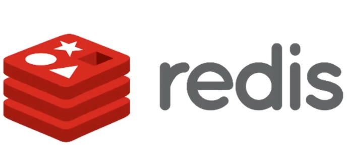
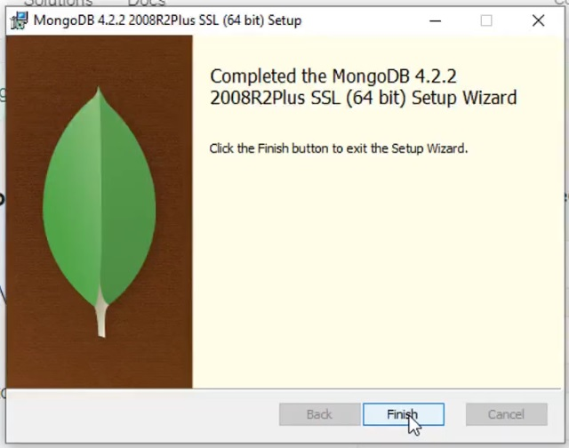
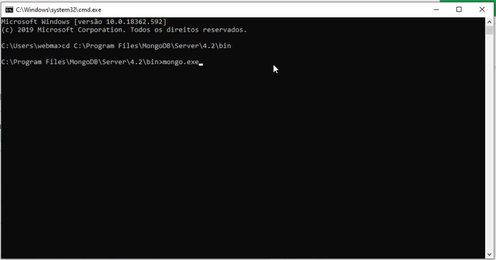
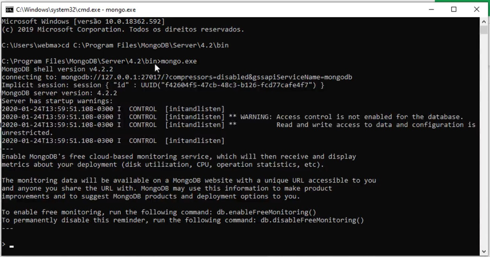
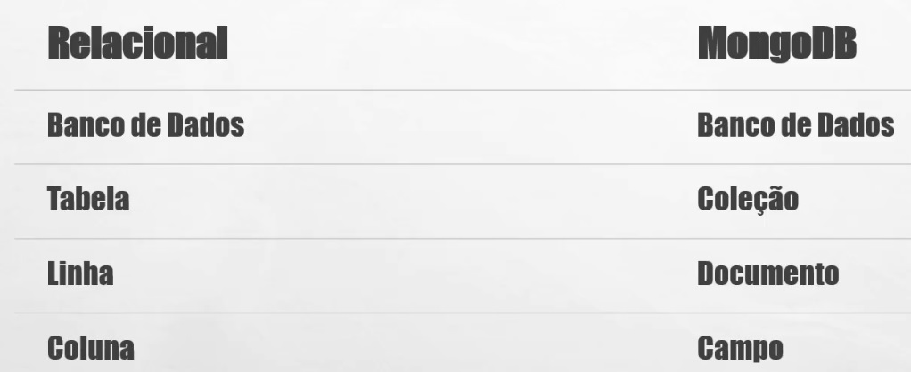

# Bancos de Dados NoSQL

#### 14/04/2026 {.unnumbered}

#### Professor Miguél Suares {.unnumbered}

## O que São Banco de Dados NoSQL ?

São Sistemas de Gerenciamento de Banco de Dados (SGBDs) que tem suas
Restrições do modelo Relacional FLEXIBILIZADAS.

-   DESNORMALIZADOS;
-   SEM RESTRIÇÃO DE INTEGRIDADE;
-   MODELO TRANSACIONAL MAIS FLEXÍVEL

## Vantagens do uso dos SGBDs NoSQL

Surgiram para resolver problemas encontrados nos SGBDs Relacionais:

-   Processamento;
-   Paralelismo;
-   Custo;

## Tipos de SGBDs NoSQL

-   Chave-Valor (KVP);
-   Colunas Ordenadas;
-   Orientados a Documentos;
-   Orientados a GRAFOS;

### SGBDs NoSQL tipo Chave-Valor (KVP)



São utilizados em aplicações WEB para armazenahr sessões de usuário,
fazer cache de dados temporários e Filas de Mensagens. Exemplo: REDIS

-   Altíssimo Desempenho: Acesso direto por chave (lookup O(1)); Roda na
    RAM; REDIS

-   Escalabilidade Horizontal: Fácil de adicionar nós (clusterização).

-   Simplicidade de Modelagem: O Código-Valor ; Não exige JOINS ou
    relacionamentos;

-   Felxibilidade de Dados: STRING, JSON, Listas e HASHs

### SGBDs NoSQL tipo Colunares (Colunas Ordenadas)


Utilizados em aplicações de grande volume de dados não estruturados como
IoT, Redes Sociais e Log de Eventos. Exemplos: Cassandra, BIG Table
(Google) e Apache HBASE (plugin Postgres).

-   Alta Performance Seletiva: Permitem ler apenas as colunas
    necessárias, ao invés da linha inteira;

-   Escalabilidade Horizontal: Projetados para rodar em clusters
    distribuídos;

-   Tolerância a Falhas: Replicação automática dos dados;

-   Felxibilidade de Esquemas: Não exigem estrutura fixa;

-   Otimizados para dados não-estruturados (BIG DATA): Suportam
    Petabytes de dados; Suportam milhões de operações por segundo;

### SGBDs NoSQL tipo suporte a Documentos (JSON)


Os bancos NoSQL orientados a documentos — como o **MongoDB** — armazenam
dados em formato JSON/BSON, o que traz vantagens importantes em relação
aos SGBDs relacionais, dependendo do cenário. Aplicações Web e APIs;
e-commerce. Exemplo Clássico: **MongoDB**

-   No caso do MongoDB, o mesmo utiliza **JavaScript** no lugar do
    **SQL**;

-   Flexibilidade de esquema (schema-less): Não exige estrutura rígida
    de tabelas Cada documento pode ter campos diferentes;

-   Estrutura próxima do mundo real: (JSON) Dados organizados em
    documentos hierárquicos Evita várias tabelas e JOINs;

-   Melhor desempenho em leituras complexas: Dados relacionados ficam no
    mesmo documento; Reduz necessidade de JOINs (que são custosos no
    relacional)

### SGBDs NoSQL tipo GRAFOs:


São muito úteis por natureza em Redes sociais, Sistemas de Recomendação,
Detecção de Fraude, Logística e rotas e Interação de dados entre
**LLM**s. Exemplo: **Neo4J**.

-   Modelagem natural de relacionamentos: Relações são primeiros
    cidadãos (arestas) Não precisam de tabelas intermediárias (tabelas
    de junção);

-   Alta performance em consultas de relacionamento: Traversal
    (percorrer o grafo) é muito rápido; Evita múltiplos JOINs (custosos
    no relacional).

-   Consultas mais expressivas: Linguagens como **Cypher** (do
    **Neo4j**); Permite escrever consultas complexas de forma simples.

-   Muito Usado em I.A. pois se dá muito bem com **LLM**s.

------------------------------------------------------------------------

#### Convertendo uma tabela SQL para o modelo de Grafos utilizando a linguagem Cypher

``` {.TEXT .cypher}
| SQL         | Neo4j (Cypher)            |
| ----------- | ------------------------- |
| DATABASE    | Database (multi-db Neo4j) |
| TABLE       | Label (rótulo de nó)      |
| ROW         | Node                      |
| COLUMN      | Property                  |
| PRIMARY KEY | Constraint UNIQUE         |
| INDEX       | Index                     |
```

#### Tabela Pessoas declarada em SQL

``` sql
CREATE DATABASE IF NOT EXISTS pessoasdb
  CHARACTER SET utf8mb4
  COLLATE utf8mb4_0900_ai_ci;

USE pessoasdb;

-- 2) (OPCIONAL) CRIAR USUÁRIO LOCAL E CONCEDER PERMISSÕES
--    Troque 'MinhaSenhaForte' por uma senha segura
CREATE USER IF NOT EXISTS 'pessoas_user'@'localhost' IDENTIFIED BY 'MinhaSenhaForte';
GRANT ALL PRIVILEGES ON pessoasdb.* TO 'pessoas_user'@'localhost';
FLUSH PRIVILEGES;

-- 3) TABELA 'pessoas' COMPATÍVEL COM O MODELO SQLAlchemy
--    - cpf: chave primária (String(14))
--    - nome, endereco, foto: TEXT
--    - data_nascimento: DATE
CREATE TABLE IF NOT EXISTS pessoas (
  cpf             VARCHAR(14)  NOT NULL,
  nome            TEXT         NOT NULL,
  endereco        TEXT         NOT NULL,
  data_nascimento DATE         NOT NULL,
  foto            TEXT         NULL,
  PRIMARY KEY (cpf)
) ENGINE=InnoDB DEFAULT CHARSET=utf8mb4 COLLATE=utf8mb4_0900_ai_ci;

-- 4) (OPCIONAL) ÍNDICES PARA BUSCA
-- Seu endpoint usa LIKE/ILIKE em nome e cpf; cpf já é PK.
-- Para acelerar buscas por nome com LIKE, crie um índice por prefixo.
-- OBS: índices em TEXT precisam de comprimento; 128 costuma ser um bom compromisso.
CREATE INDEX idx_pessoas_nome_prefix ON pessoas (nome(128));
```

#### Nó Pessoas declarado em Cypher

``` cypher
// Criamos a base de dados pessoadb
CREATE DATABASE pessoasdb;

:USE pessoasdb

CREATE USER pessoas_user SET PASSWORD 'MinhaSenhaForte' CHANGE NOT REQUIRED;

GRANT ALL ON DATABASE pessoasdb TO pessoas_user;

// não criamos tabela explicitamente.
// Criamos o Label Pessoa

CREATE CONSTRAINT pessoa_cpf_unique IF NOT EXISTS
FOR (p:Pessoa)
REQUIRE p.cpf IS UNIQUE;


CREATE INDEX pessoa_nome_index IF NOT EXISTS
FOR (p:Pessoa)
ON (p.nome);

CREATE (p:Pessoa {
  cpf: "123.456.789-00",
  nome: "João Silva",
  endereco: "São Paulo",
  data_nascimento: date("1990-01-01"),
  foto: null
});
```

------------------------------------------------------------------------

## MongoDB - INSTALANDO E ACESSANDO O SERVIDOR

O SGBD é aberto e pode ser [baixando e instalado para Windows 10 e 11 no
site do MongoDB.](https://www.mongodb.com/try/download/community)



Após instala-lo devemos inicializa-lo pela primeira vez entrando no
diretório de arquivos binários executáveis do pacote instalado.

Realizamos a primeira execução com o comando **mongo.exe**



A tela então irá nos apresentar o cliente texto , onde podemos executar
os comandos JavaScript que irão imitar as funcionalidades SQL de criar
estruturas de armazenamento de dados e manipulação dos dados
armazenados.



Instalação finalizada.

------------------------------------------------------------------------

## SGBDs NoSQL Orientado a Documentos: MongoDB

Vamos agora mapear a base de dados declarada abaixo no SGBD PostgreSQL
utilizando a linguagem SQL para o SGBD NoSQL orientado a documentos
MongoDB através da linguagem JavaScript

### Novo Paradigma, Nova Nomenclatura, Velhos Conhecidos:



### Tipos de dados suportados nos campos (colunas)


### Criação de Estruturas de Armazenamento de Dados no MongoDB (equivalência SQL DDL)

A tabela abaixo apresenta um mapeamento de funcionalidades para criar o
equivalente entre esquemas, tabelas, e colunas no MongoDB.

| Operação / Conceito | SQL (PostgreSQL / MySQL) | MongoDB (mongosh) |
|----------------|---------------------------|------------------------------|
| Criar banco de dados | CREATE DATABASE pessoasdb; | use pessoasdb *(cria implicitamente ao inserir dados)* |
| Selecionar banco | USE pessoasdb; | use pessoasdb |
| Excluir banco | DROP DATABASE pessoasdb; | db.dropDatabase() |
| Criar tabela | CREATE TABLE pessoas (...); | db.createCollection("pessoas") |
| Excluir tabela | DROP TABLE pessoas; | db.pessoas.drop() |
| Alterar tabela | ALTER TABLE pessoas ADD coluna ...; | db.runCommand({ collMod: "pessoas", ... }) *(limitado)* |
| Adicionar coluna | ALTER TABLE pessoas ADD endereco TEXT; |  Não necessário (schema flexível) |
| Remover coluna | ALTER TABLE pessoas DROP COLUMN endereco; | Não necessário (usar \$unset nos documentos) |
| Modificar coluna | ALTER TABLE pessoas MODIFY nome VARCHAR(100); | Não necessário (schema flexível) |
| Criar índice | CREATE INDEX idx_nome ON pessoas(nome); | db.pessoas.createIndex({ nome: 1 }) |
| Criar índice único | CREATE UNIQUE INDEX idx_cpf ON pessoas(cpf); | db.pessoas.createIndex({ cpf: 1 }, { unique: true }) |
| Remover índice | DROP INDEX idx_nome ON pessoas; | db.pessoas.dropIndex("nome_1") |
| Chave primária | PRIMARY KEY (cpf) | Índice único: db.pessoas.createIndex({ cpf: 1 }, { unique: true }) |
| Chave estrangeira | FOREIGN KEY (id) REFERENCES outra_tabela(id) |  Não suportado nativamente (referência via aplicação) |
| Constraints (NOT NULL) | nome TEXT NOT NULL |  Não obrigatório (validar via schema validator opcional) |
| Constraints (CHECK) | CHECK (idade \> 0) | db.createCollection("pessoas", { validator: { idade: { \$gt: 0 } } }) |
| Charset / Collation | CHARACTER SET utf8mb4 COLLATE utf8mb4_0900_ai_ci | Definido no nível de coleção: collation opcional |

### ManipulandoDados no MongoDB (equivalência SQL DML)

A tabela abaixo apresenta um mapeamento de funcionalidades para
manipular dados no equivalente entre esquemas, tabelas, e colunas no
MongoDB.

| Operação / Conceito | SQL (PostgreSQL / MySQL) | MongoDB (mongosh) |
|----------------|---------------------------|------------------------------|
| Inserir registro | INSERT INTO pessoas (cpf, nome) VALUES ('1','Ana'); | db.pessoas.insertOne({ cpf: "1", nome: "Ana" }) |
| Inserir múltiplos | INSERT INTO pessoas (...) VALUES (...), (...); | db.pessoas.insertMany([{...}, {...}]) |
| Consultar todos | SELECT \* FROM pessoas; | db.pessoas.find() |
| Consultar com filtro | SELECT \* FROM pessoas WHERE cpf='1'; | db.pessoas.find({ cpf: "1" }) |
| Buscar um registro | SELECT \* FROM pessoas WHERE cpf='1' LIMIT 1; | db.pessoas.findOne({ cpf: "1" }) |
| Projeção de colunas | SELECT nome, cpf FROM pessoas; | db.pessoas.find({}, { nome: 1, cpf: 1, \_id: 0 }) |
| Atualizar registro | UPDATE pessoas SET nome='Ana B' WHERE cpf='1'; | db.pessoas.updateOne({ cpf: "1" }, { \$set: { nome: "Ana B" } }) |
| Atualizar múltiplos | UPDATE pessoas SET ativo=true WHERE cidade='SP'; | db.pessoas.updateMany({ cidade: "SP" }, { \$set: { ativo: true } }) |
| Remover registro | DELETE FROM pessoas WHERE cpf='1'; | db.pessoas.deleteOne({ cpf: "1" }) |
| Remover múltiplos | DELETE FROM pessoas WHERE cidade='SP'; | db.pessoas.deleteMany({ cidade: "SP" }) |
| Ordenar resultados | SELECT \* FROM pessoas ORDER BY nome ASC; | db.pessoas.find().sort({ nome: 1 }) |
| Ordenar desc | SELECT \* FROM pessoas ORDER BY nome DESC; | db.pessoas.find().sort({ nome: -1 }) |
| Limitar resultados | SELECT \* FROM pessoas LIMIT 5; | db.pessoas.find().limit(5) |
| Paginação (offset) | SELECT \* FROM pessoas LIMIT 5 OFFSET 10; | db.pessoas.find().skip(10).limit(5) |
| Contar registros | SELECT COUNT(\*) FROM pessoas; | db.pessoas.countDocuments() |
| Contar com filtro | SELECT COUNT(\*) FROM pessoas WHERE cidade='SP'; | db.pessoas.countDocuments({ cidade: "SP" }) |
| LIKE (busca textual) | SELECT \* FROM pessoas WHERE nome LIKE '%ana%'; | db.pessoas.find({ nome: { \$regex: "ana", \$options: "i" } }) |
| IN | SELECT \* FROM pessoas WHERE cpf IN ('1','2'); | db.pessoas.find({ cpf: { \$in: ["1", "2"] } }) |
| AND | SELECT \* FROM pessoas WHERE cidade='SP' AND ativo=1; | db.pessoas.find({ cidade: "SP", ativo: true }) |
| OR | SELECT \* FROM pessoas WHERE cidade='SP' OR cidade='RJ'; | db.pessoas.find({ \$or: [{ cidade: "SP" }, { cidade: "RJ" }] }) |
| BETWEEN | SELECT \* FROM pessoas WHERE idade BETWEEN 18 AND 30; | db.pessoas.find({ idade: { \$gte: 18, \$lte: 30 } }) |
| DISTINCT | SELECT DISTINCT cidade FROM pessoas; | db.pessoas.distinct("cidade") |
| JOIN (simples) | SELECT p.\*, c.nome FROM pessoas p JOIN cidades c ON p.cid_id = c.id; | db.pessoas.aggregate([{ \$lookup: { from: "cidades", localField: "cid_id", foreignField: "id", as: "cidades" } }]) |

------------------------------------------------------------------------

## Exemplode Aplicação com o MongoDB

##### Origem: PostgreSQL - Linguagem SQL DDL (Data Definition Language)

``` sql
CREATE DATABASE IF NOT EXISTS pessoasdb
  CHARACTER SET utf8mb4
  COLLATE utf8mb4_0900_ai_ci;

USE pessoasdb;

-- 2) (OPCIONAL) CRIAR USUÁRIO LOCAL E CONCEDER PERMISSÕES
--    Troque 'MinhaSenhaForte' por uma senha segura
CREATE USER IF NOT EXISTS 'pessoas_user'@'localhost' IDENTIFIED BY 'MinhaSenhaForte';
GRANT ALL PRIVILEGES ON pessoasdb.* TO 'pessoas_user'@'localhost';
FLUSH PRIVILEGES;

-- 3) TABELA 'pessoas' COMPATÍVEL COM O MODELO SQLAlchemy
--    - cpf: chave primária (String(14))
--    - nome, endereco, foto: TEXT
--    - data_nascimento: DATE
CREATE TABLE IF NOT EXISTS pessoas (
  cpf             VARCHAR(14)  NOT NULL,
  nome            TEXT         NOT NULL,
  endereco        TEXT         NOT NULL,
  data_nascimento DATE         NOT NULL,
  foto            TEXT         NULL,
  PRIMARY KEY (cpf)
) ENGINE=InnoDB DEFAULT CHARSET=utf8mb4 COLLATE=utf8mb4_0900_ai_ci;

-- 4) (OPCIONAL) ÍNDICES PARA BUSCA
-- Seu endpoint usa LIKE/ILIKE em nome e cpf; cpf já é PK.
-- Para acelerar buscas por nome com LIKE, crie um índice por prefixo.
-- OBS: índices em TEXT precisam de comprimento; 128 costuma ser um bom compromisso.
CREATE INDEX idx_pessoas_nome_prefix ON pessoas (nome(128));
```

##### Destino: MongoDB - Linguagem JAVASCRIPT

``` javascript
// 1) Criar/usar o banco de dados
use pessoasdb

// 2) Criar usuário local e conceder permissões
db.createUser({
  user: "pessoas_user",
  pwd: "MinhaSenhaForte",
  roles: [
    {
      role: "readWrite",
      db: "pessoasdb"
    }
  ]
})

// 3) Criar coleção equivalente à tabela pessoas
db.createCollection("pessoas")

// 4) Criar índice único para cpf
// Equivalente à PRIMARY KEY do SQL
db.pessoas.createIndex(
  { cpf: 1 },
  { unique: true, name: "idx_pessoas_cpf_unique" }
)

// 5) Criar índice para busca por nome
db.pessoas.createIndex(
  { nome: 1 },
  { name: "idx_pessoas_nome" }
)
```

------------------------------------------------------------------------

## Para testar a base de dados em um CRUD

Considere que você tenha um CRUD (cadastro) implantado através de
conexão RESTFul entre cliente e servidor de aplicação. O cliente WEB é
construído em (HTML + Javascript). O Servidor de Aplicação Python se
conectava a um servidor de Banco de Dados PostgreSQL.

### Criando a base de dados "Pessoas" no SGBD MongoDB

### Trocando a conexão do SGBD Relacional PostgreSQL para SGBD NoSQL MongoDB

Para mudar a SGBD anterior, basta trocar os pacotes de conexão
PostgreSQL do servidor de aplicação anetrior para os pacotes de conexão
MongoDB do python.

```         
PostgreSQL        -> MongoDB
================================================
psycopg2-binary   -> pymongo
SQLAlchemy        -> geralmente não é necessário
================================================
Tabela            -> Collection
Linha             -> Document
Coluna            -> Field
```

``` cmd
python -m pip install --user --upgrade flask flask-cors pymongo pydantic
```

Em seguida, é só mapear as portas de conexão do servidor python:

``` python
from flask import Flask, request, jsonify
from flask_cors import CORS
from pymongo import MongoClient, ASCENDING
from pymongo.errors import DuplicateKeyError

# ------------------------------
# Configuração do Flask e CORS
# ------------------------------
app = Flask(__name__)
CORS(app)

# ------------------------------
# Configuração do MongoDB
# ------------------------------
MONGO_URL = "mongodb://localhost:27017/"

cliente = MongoClient(MONGO_URL)

db = cliente["pessoasdb"]
pessoas = db["pessoas"]

# Índices
pessoas.create_index([("cpf", ASCENDING)], unique=True)
pessoas.create_index([("nome", ASCENDING)])

# ------------------------------
# Função auxiliar
# ------------------------------
def pessoa_para_json(pessoa):
    return {
        "cpf": pessoa.get("cpf"),
        "nome": pessoa.get("nome"),
        "endereco": pessoa.get("endereco"),
        "data_nascimento": pessoa.get("data_nascimento"),
        "foto": pessoa.get("foto")
    }

# ------------------------------
# CRUD
# ------------------------------

# Listar todas as pessoas ou pesquisar por termo
@app.route('/pessoas', methods=['GET'])
def listar():
    termo = request.args.get('q', '')

    if termo:
        filtro = {
            "$or": [
                {"nome": {"$regex": termo, "$options": "i"}},
                {"cpf": {"$regex": termo, "$options": "i"}}
            ]
        }
    else:
        filtro = {}

    resultado = pessoas.find(filtro, {"_id": 0})

    return jsonify([pessoa_para_json(p) for p in resultado])


# Inserir nova pessoa
@app.route('/pessoas', methods=['POST'])
def inserir():
    dados = request.get_json()

    nova_pessoa = {
        "cpf": dados["cpf"],
        "nome": dados["nome"],
        "endereco": dados["endereco"],
        "data_nascimento": dados["data_nascimento"],
        "foto": dados.get("foto")
    }

    try:
        pessoas.insert_one(nova_pessoa)
        return jsonify({"message": "Inserido com sucesso"}), 201

    except DuplicateKeyError:
        return jsonify({"error": "CPF já cadastrado"}), 400


# Alterar pessoa
@app.route('/pessoas/<cpf>', methods=['PUT'])
def alterar(cpf):
    dados = request.get_json()

    atualizacao = {}

    if "nome" in dados:
        atualizacao["nome"] = dados["nome"]

    if "endereco" in dados:
        atualizacao["endereco"] = dados["endereco"]

    if "data_nascimento" in dados:
        atualizacao["data_nascimento"] = dados["data_nascimento"]

    if "foto" in dados:
        atualizacao["foto"] = dados["foto"]

    resultado = pessoas.update_one(
        {"cpf": cpf},
        {"$set": atualizacao}
    )

    if resultado.matched_count == 0:
        return jsonify({"error": "CPF não encontrado"}), 404

    return jsonify({"message": "Alterado com sucesso"})


# Remover pessoa
@app.route('/pessoas/<cpf>', methods=['DELETE'])
def remover(cpf):
    resultado = pessoas.delete_one({"cpf": cpf})

    if resultado.deleted_count == 0:
        return jsonify({"error": "CPF não encontrado"}), 404

    return jsonify({"message": "Removido com sucesso"})


# Buscar pessoa por CPF
@app.route('/pessoas/<cpf>', methods=['GET'])
def buscar(cpf):
    pessoa = pessoas.find_one({"cpf": cpf}, {"_id": 0})

    if not pessoa:
        return jsonify({"error": "CPF não encontrado"}), 404

    return jsonify(pessoa_para_json(pessoa))


# ------------------------------
# Inicia o servidor
# ------------------------------
if __name__ == '__main__':
    app.run(debug=True, port=5000)
```

Salve o código acima como **servidor.py** e, em seguida, mande rodar com
o código abaixo:

``` cmd
python servidor.py
```

#### OBS: Alterações no código do Servidor.py

As seguintes alterações foram aplicadas no servidor python. Basicamente,
no local onde havia código SQL foi feita a troca por uma função da
biblioteca do MongoDB.

Segue a relação de trocas ocorridas no código python original.

``` text
Tabela pessoas                    ->  Coleção pessoas
Linha                             ->  Documento
Coluna                            ->  Campo
PRIMARY KEY cpf                   ->  Índice único em cpf
SELECT                            ->  find()
INSERT                            ->  insert_one()
UPDATE                            ->  update_one()
DELETE                            ->  delete_one()
```

### Anexo do exemplo: O código do cliente WEB (html + javascript)

Salve o código abaixo como **cliente.html** e abra no seu navegador:

``` html
<!DOCTYPE html>
<html lang="pt-BR">
<head>
<meta charset="UTF-8">
<title>Cadastro de Pessoas - Flask/MySQL</title>
<style>
  body { font-family: system-ui, -apple-system, Segoe UI, Roboto, Arial; max-width: 980px; margin: 24px auto; }
  label { display: block; margin-top: 10px; }
  button { margin-top: 10px; margin-right: 6px; padding: 8px 12px; }
  table { border-collapse: collapse; width:100%; margin-top:20px; }
  th, td { border:1px solid #ddd; padding:8px; text-align:left; }
  img.thumb { width:60px; height:60px; object-fit:cover; border-radius:4px; }
  .row { display:flex; gap:8px; align-items:center; flex-wrap:wrap; }
</style>
</head>
<body>
<h1>Cadastro de Pessoas (Flask/MySQL)</h1>

<form id="formPessoa">
  <label>CPF (chave primária): <input id="cpf" required></label>
  <label>Nome: <input id="nome" required></label>
  <label>Endereço: <input id="endereco" required></label>
  <label>Data Nasc.: <input type="date" id="data_nascimento" required></label>
  <label>Foto: <input type="file" id="foto" accept="image/*"></label>

  <div class="row">
    <button type="button" id="btnInserir" onclick="inserir()">Inserir</button>
    <button type="button" id="btnAlterar" onclick="alterar()">Alterar</button>
    <button type="button" id="btnRemover" onclick="remover()">Remover</button>
  </div>
</form>

<h2>Pesquisar</h2>
<div class="row">
  <input id="pesquisa" placeholder="Digite nome ou CPF" style="flex:1">
  <button type="button" id="btnPesquisar" onclick="pesquisar()">Pesquisar</button>
  <button type="button" onclick="listar()">Listar tudo</button>
</div>

<table>
  <thead>
    <tr>
      <th>CPF</th><th>Foto</th><th>Nome</th>
      <th>Endereço</th><th>Nascimento</th>
    </tr>
  </thead>
  <tbody id="tabela"></tbody>
</table>

<script>
const API = 'http://localhost:5000/pessoas';

/* ---------- Helpers ---------- */
function setBusy(busy) {
  for (const id of ['btnInserir','btnAlterar','btnRemover','btnPesquisar']) {
    const el = document.getElementById(id);
    if (el) el.disabled = busy;
  }
}

function validaCampos() {
  const campos = ['cpf','nome','endereco','data_nascimento'];
  for (const id of campos) {
    const valor = document.getElementById(id).value.trim();
    if (!valor) {
      alert(`O campo "${id}" não pode ficar em branco.`);
      return false;
    }
  }
  return true;
}

function getFotoBase64() {
  const file = document.getElementById('foto').files[0];
  if(!file) return Promise.resolve('');
  return new Promise((resolve,reject)=>{
    const reader = new FileReader();
    reader.onload = () => resolve(reader.result);
    reader.onerror = reject;
    reader.readAsDataURL(file);
  });
}

function coletaDados(base64Foto){
  return {
    cpf: document.getElementById('cpf').value.trim(),
    nome: document.getElementById('nome').value.trim(),
    endereco: document.getElementById('endereco').value.trim(),
    data_nascimento: document.getElementById('data_nascimento').value, // YYYY-MM-DD
    foto: base64Foto || ''
  };
}

async function readJsonSafe(res) {
  const ct = res.headers.get('content-type') || '';
  if (ct.includes('application/json')) {
    try { return await res.json(); } catch { return null; }
  }
  return null;
}

/* ---------- CRUD ---------- */
async function inserir() {
  if(!validaCampos()) return;
  setBusy(true);
  try {
    const base64 = await getFotoBase64();
    const pessoa = coletaDados(base64);

    const res = await fetch(API, {
      method: 'POST',
      headers: {'Content-Type': 'application/json'},
      body: JSON.stringify(pessoa)
    });
    const data = await readJsonSafe(res);
    if(res.ok) {
      alert('Inserido com sucesso!');
      listar();
      document.getElementById('formPessoa').reset();
    } else {
      alert('Erro: ' + (data?.error || res.statusText));
    }
  } catch (e) {
    alert('Falha ao inserir: ' + e.message);
  } finally {
    setBusy(false);
  }
}

async function alterar() {
  if(!validaCampos()) return;
  const cpf = document.getElementById('cpf').value.trim();
  setBusy(true);
  try {
    const base64 = await getFotoBase64();
    const novosDados = coletaDados();
    if (base64) novosDados.foto = base64;

    const res = await fetch(`${API}/${encodeURIComponent(cpf)}`, {
      method: 'PUT',
      headers: {'Content-Type': 'application/json'},
      body: JSON.stringify(novosDados)
    });
    const data = await readJsonSafe(res);
    if(res.ok) {
      alert('Alterado com sucesso!');
      listar();
    } else {
      alert('Erro: ' + (data?.error || res.statusText));
    }
  } catch (e) {
    alert('Falha ao alterar: ' + e.message);
  } finally {
    setBusy(false);
  }
}

async function remover() {
  const cpf = document.getElementById('cpf').value.trim();
  if(!cpf) return alert('Informe o CPF para remover.');
  if(!confirm('Confirma a exclusão?')) return;

  setBusy(true);
  try {
    const res = await fetch(`${API}/${encodeURIComponent(cpf)}`, {method:'DELETE'});
    // 204 => sem corpo; não tente parsear JSON aqui
    if(res.status === 204) {
      alert('Removido com sucesso!');
      listar();
      return;
    }
    const data = await readJsonSafe(res);
    if(res.ok) {
      alert('Removido com sucesso!');
      listar();
    } else {
      alert('Erro: ' + (data?.error || res.statusText));
    }
  } catch (e) {
    alert('Falha ao remover: ' + e.message);
  } finally {
    setBusy(false);
  }
}

async function pesquisar() {
  const termo = document.getElementById('pesquisa').value.trim();
  setBusy(true);
  try {
    const url = termo ? `${API}?q=${encodeURIComponent(termo)}` : API;
    const res = await fetch(url);
    const data = await readJsonSafe(res);
    if(!res.ok) return alert('Falha na pesquisa: ' + (data?.error || res.statusText));
    preencheTabela(Array.isArray(data) ? data : (data?.items ?? []));
  } catch (e) {
    alert('Falha na pesquisa: ' + e.message);
  } finally {
    setBusy(false);
  }
}

async function listar() {
  setBusy(true);
  try {
    const res = await fetch(API);
    const data = await readJsonSafe(res);
    if(!res.ok) return alert('Falha ao listar: ' + (data?.error || res.statusText));
    preencheTabela(Array.isArray(data) ? data : (data?.items ?? []));
  } catch (e) {
    alert('Falha ao listar: ' + e.message);
  } finally {
    setBusy(false);
  }
}

/* ---------- UI ---------- */
function preencheTabela(lista){
  const tbody = document.getElementById('tabela');
  tbody.innerHTML = '';
  (lista || []).forEach(p=>{
    const tr = document.createElement('tr');
    tr.innerHTML = `
      <td>${p.cpf}</td>
      <td>${p.foto ? `` : ''}</td>
      <td>${p.nome}</td>
      <td>${p.endereco}</td>
      <td>${p.data_nascimento}</td>`;
    tr.onclick = () => {
      document.getElementById('cpf').value = p.cpf;
      document.getElementById('nome').value = p.nome;
      document.getElementById('endereco').value = p.endereco;
      document.getElementById('data_nascimento').value = p.data_nascimento;
    };
    tbody.appendChild(tr);
  });
}

listar();
</script>
</body>
</html>
```

Preencha os campos do cadastro e verifique os documentos do SGBD
MongoDB.

```{r 08-PostGreSQL-01-aula-html, eval=FALSE, message=FALSE, warning=FALSE, include=FALSE}

rmarkdown::render("08-2026-2026-04-14_NoSQL-aula.Rmd", output_dir="docs", output_file ="temporario.html" , output_format = "html_document") ; 

utils::browseURL("docs/temporario.html")

```
